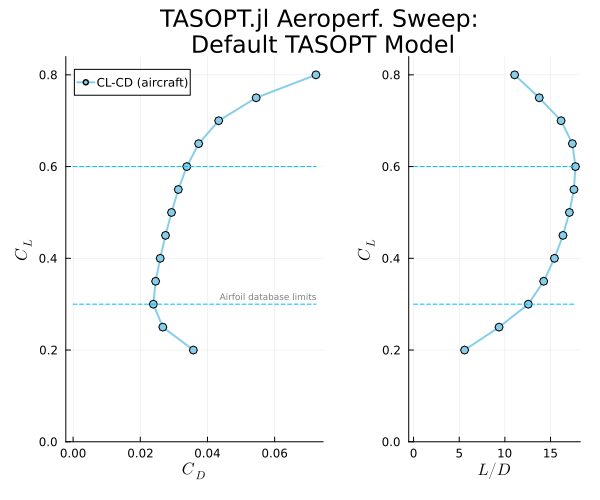
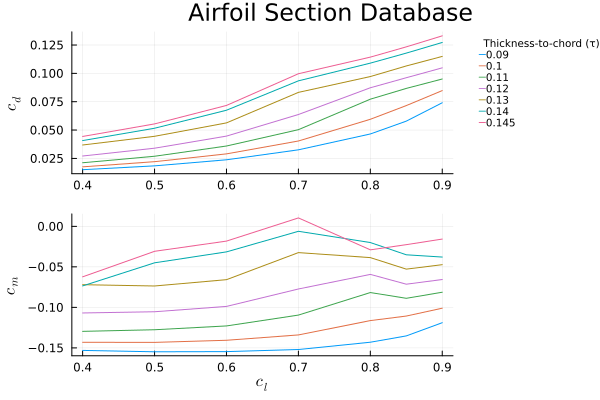

# Summary and outputs

## Core assumptions


!!! details "📖 In Drela's Words - aerodynamic summary"

    The wing airfoil performance is represented by a parameterized transonic airfoil family spanning a range of thicknesses, whose performance is determined by 2D viscous/inviscid CFD calculation for a range of lift coefficients and Mach numbers. Together with suitable sweep corrections, this gives reliable profile+wave drag of the wing in cruise and high climb and high descent. The fuselage drag is likewise obtained from compressible viscous/inviscid CFD, suitably simplified with axisymmetric-based approximations. A side benefit is that detailed knowledge of the fuselage boundary layers makes it possibly for TASOPT to reliably predict the benefits of boundary layer ingestion in fuselage-mounted engines.

    The drag of only the minor remaining components such as nacelles is obtained by traditional wetted area methods, but corrected for supervelocities estimated with vortex sheet models. Induced drag is predicted by fairly standard Trefftz-Plane analysis

The following table summarizes the modelling assumptions for the aerodynamic contributors. Excrescence drag is modelled as specifiable factors for the fuselage, and wings and control surfaces.

| Component   | Lift                                     | Drag                                                        | Pitching Moment                                                                 |
|:------------|:-----------------------------------------|:------------------------------------------------------------|:--------------------------------------------------------------------------------|
| Wing        | Set by geometry and loading assumptions  | Linked to $C_L$ via 2D CFD and discretization of a finite swept wing | Linked to $C_L$ via 2D CFD and discretization of a finite swept wing. Includes airfoil pitching moment and lift contribution. |
| Fuselage    | -                                        | Profile drag via axisymmetric IBLT                          | Lift contribution from slender body theory                                      |
| Horz. Stab. | Set by stability requirements            | Finite swept wing for fixed $c_{d,f}$, $c_{d,p}$                  | Linked to $C_{L,h}$ via 2D CFD and discretization of a finite swept wing          |
| Vert. Stab. | -                                        | Finite swept wing for fixed $c_{d,f}$, $c_{d,p}$                  | -                                                                               |
| Nacelle     | -                                        | Wetted area with overspeed corrections                      | -                                                                               |

---
## Aircraft drag polars

The overall aerodynamic performance of the trimmed aircraft can be generated by [`aeroperf_sweep()`](@ref) and visualized via a [`DragPolar()`](@ref) plot:



---
## Airfoil database and summary

The default airfoil section performance database can be found at `./aero/airfoil_data/C.air` and is stored in an [`airfoil`](@ref aerodynamics.airfoil) struct within the `aircraft` struct at `TASOPT.aircraft.wing.airsection`. [`plot_airf()`](@ref) generates a summary plot of the airfoil performance:



---
```@docs
aeroperf_sweep

DragPolar

plot_airf

```
