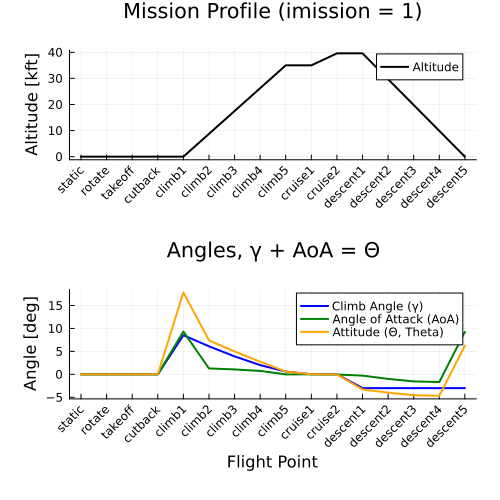

# [Aircraft attitude](@id attitude)

## Angle of attack and pitch

`C_airfoil.csv` includes the section angle-of-attack (`AoA` in radians internally; `alpha` in degrees in the source CSV). From these values, TASOPT can report the aircraft's AoA in the body reference frame and its pitch attitude (``\Theta``) in the global frame at every airborne mission point.

The chain from airfoil database to aircraft attitude is:

```math
\begin{aligned}
\alpha_\perp &= \texttt{airfun}(c_{\ell,s},\, t/c,\, M\cos\Lambda) \quad &\text{(perpendicular AoA, at the spanbreak section)}\\
\mathrm{AoA}_{\rm wing} &= \tan^{-1}\!\bigl(\cos\Lambda\,\tan\alpha_\perp\bigr) \quad &\text{(swept-wing projection to body axes)}\\
\mathrm{AoA}_{\rm ac} &= \mathrm{AoA}_{\rm wing} - \theta_{\rm mount} \quad &\text{(subtract wing incidence)}\\
\Theta &= \mathrm{AoA}_{\rm ac} + \gamma \quad &\text{(pitch attitude = AoA + flight-path angle)}
\end{aligned}
```

AoA and attitude are computed by [`aerodynamics.calc_mission_attitude!()`](@ref) and are stored in `ac.para[iaAoA, ip, im]` and `ac.para[iaTheta, ip, im]` respectively (both in radians).
Attitude is populated only for airborne mission phases (`ipclimb1:ipdescentn`); ground and takeoff-roll points are not steady trimmed-flight states and are skipped.

Two modelling choices are worth flagging:

1. **Spanbreak section is representative.** Airfoil-section AoA is sampled only at the
   wing spanbreak (`wing.outboard.cross_section.thickness_to_chord`) — its value is taken
   to characterize the whole wing for AoA purposes.
2. **Wing mounting angle zeroes AoA at design cruise point.** `Wing.mounting_angle`
   (``\theta_{\rm mount}``) is set automatically at the end of `_size_aircraft!` to the
   spanbreak body-frame AoA at `ipcruise1`, so `iaAoA = 0` at design cruise. All other
   `iaAoA` values are offsets from that point.

The mission-wide attitude profile can be visualized with [`plot_trajectory()`](@ref).



```@docs
aerodynamics.calc_wing_aoa

aerodynamics.calc_ac_AoA

aerodynamics.calc_ac_AoA!

aerodynamics.calc_ac_Theta!

aerodynamics.calc_mission_attitude!

plot_trajectory
```
