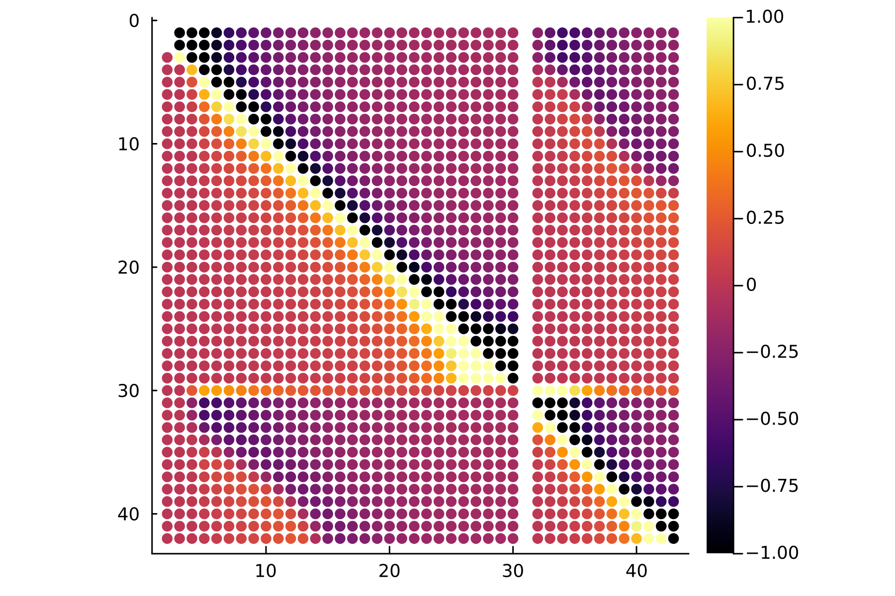

# Drag

The key drag contributions are assumed to come from the fuselage, wing, and tail surfaces, and the lift-induced drag calculated at the Trefftz plane. Wave drag is not explicitly modelled.


## [Axisymmetric fuselage drag](@id axi)
The fuselage profile drag is determined by a quasi-axisymmetric coupled viscous-inviscid calculation. See [Simplified Viscous/Inviscid Analysis for Nearly-Axisymmetric Bodies](../assets/drela_TASOPT_2p16/axibl.pdf) by M. Drela.

This method does not require any wetted area approximations or fineness-ratio correlations, but does require the geometry to be specified in the form of a
cross-sectional area distribution $A{\scriptstyle (x)}$ and a
perimeter distribution $b_0{\scriptstyle (x)}$, shown in the
Figure below. For a round cross-section these are, of course, related. To allow treating
more general fuselage cross-sections, they are assumed to be specified
separately. The cross section sizes and shapes can vary along the body,
provided the variation is reasonably smooth.


```@eval
using Markdown
Markdown.parse_file(joinpath("../..", "src/aero","theory_fuse_profile_drag.md"))
```

```@docs
aerodynamics._axisymm_flow(xnose,xend,xblend1,xblend2, Amax, 
	anose, btail, iclose,
	Mach, nc, nldim,
      xl, zl, sl, dyl, ql)

aerodynamics._BL_station_system(is_selfsimilar, is_laminar, is_wake, solves_direct, Mach, uinv,
                      hksep, x,b,rn,th,ds,ue,
                      h , h_th, h_ds,
                      hk, hk_th, hk_ds, hk_ue,
                      hc, hc_th, hc_ds, hc_ue,
                      hs, hs_th, hs_ds, hs_ue,
                      cf, cf_th, cf_ds, cf_ue,
                      di, di_th, di_ds, di_ue,
                      xm,bm,rnm,thm,dsm,uem, 
                      hm , hm_thm, hm_dsm,
                      hkm, hkm_thm, hkm_dsm, hkm_uem,
                      hcm, hcm_thm, hcm_dsm, hcm_uem,
                      hsm, hsm_thm, hsm_dsm, hsm_uem,
                      cfm, cfm_thm, cfm_dsm, cfm_uem,
                      dim, dim_thm, dim_dsm, dim_uem)

aerodynamics._axisymm_BL(ndim, n,ite, xi, bi, rni, uinv, Reyn, Mach, fexcr)

aerodynamics._BL_station_vars(is_selfsimilar, is_laminar, is_wake, Reyn,Mach, fexcr,
                      x, θ ,δs ,ue )

aerodynamics.fuselage_drag!(fuse, parm, para, ip)
```

---

## [Trefftz plane drag calculation](@id trefftz)

Trefftz plane analysis computes the induced drag from multiple lifting surfaces (wing + horizontal tail). The lift distributions are propagated downstream, accounting for streamline contraction from fuselage thickness variation as shown in the Figure below.


Two shaded streamtubes are shown. Wake center radius $y'_o$ is nonzero due to the fuselage viscous wake displacement area.

The vorticity in the wake is numerically integrated at collocation points to determine the overall induced drag.


Trefftz Plane vortices $i,i\!+\!1 \ldots$ and collocation points
$i\!+\!1/2$ used for velocity, impulse, and kinetic energy calculations.
Left/right symmetry is exploited.

### Multi-surface formulation

The induced drag calculation uses a discrete vortex method with a pre-computed influence matrix. For wing and tail surfaces, the system is:

$$\mathbf{A}\boldsymbol{\Gamma} = \mathbf{w}$$

where $\mathbf{A}$ is the aerodynamic influence matrix (purely geometric), $\boldsymbol{\Gamma}$ is the wake circulation vector, and $\mathbf{w}$ is the normal velocity at control points.

Each influence coefficient $A_{ij}$ represents the velocity induced at control point $i$ by a unit vortex at wake point $j$, including its mirror image:

$$A_{ij} = \frac{(\hat{\mathbf{x}} \times \mathbf{r}_{ij}) \cdot \hat{\mathbf{n}}_i}{|\mathbf{r}_{ij}|^2} - \frac{(\hat{\mathbf{x}} \times \mathbf{r}_{ij}^m) \cdot \hat{\mathbf{n}}_i}{|\mathbf{r}_{ij}^m|^2}$$

where $\mathbf{r}_{ij}$ is the vector from wake point $j$ to control point $i$, $\mathbf{r}_{ij}^m$ is the vector from the mirror image of wake point $j$, and $\hat{\mathbf{n}}_i$ is the unit normal of element $i$.

The influence matrix has block structure for wing-tail interactions:

$$\begin{bmatrix}
\mathbf{A}_{\mathrm{ww}} & \mathbf{A}_{\mathrm{wt}} \\
\mathbf{A}_{\mathrm{tw}} & \mathbf{A}_{\mathrm{tt}}
\end{bmatrix}
\begin{bmatrix} \boldsymbol{\Gamma}_\mathrm{wing} \\ \boldsymbol{\Gamma}_\mathrm{tail}
\end{bmatrix} =
\begin{bmatrix} \mathbf{w}_\mathrm{wing} \\ \mathbf{w}_\mathrm{tail}
\end{bmatrix}$$

The structure of this block matrix looks like:

$$\small{\left[
\begin{array}{c:c}
	\overbrace{\begin{bmatrix} 
	a_{w_1,w_1}  & a_{w_1,w_2}&\cdots & a_{w_1,w_{n_\mathrm{wing+1}}}\\
	\vdots & \ddots &  & \vdots\\
	\vdots &  &  & \vdots \\
	a_{w_{n_\mathrm{wing}},w_1}  & a_{w_1,w_2}&\cdots & a_{w_{n_\mathrm{wing}},w_{n_\mathrm{wing+1}}}\\
	\end{bmatrix}}^{\mathbf{A}_{n_\mathrm{wing}\times n_\mathrm{wing+1}}}
	&
	\overbrace{\begin{bmatrix} 
	a_{w_1,t_1}  & \cdots & a_{w_1,t_{n_\mathrm{tail+1}}} \\
	\vdots & \ddots & \vdots \\
	\vdots &  &   \vdots \\
	a_{w_{n_\mathrm{wing}},t_1} &\cdots & a_{w_{n_\mathrm{wing}},t_{n_\mathrm{tail+1}}}\\
	\end{bmatrix}}^{\mathbf{A}_{n_\mathrm{wing}\times n_\mathrm{tail+1}}} \\[2em]
	
	\hdashline \\
	
	\underbrace{\begin{bmatrix} 
	a_{t_1,w_1}  & a_{t_1,w_2}&\cdots & a_{t_1,w_{n_\mathrm{wing+1}}}\\
	\vdots & \ddots &  & \vdots\\
	a_{t_{n_\mathrm{tail}},w_1}  & a_{t_1,w_2}&\cdots & a_{t_{n_\mathrm{tail}},w_{n_\mathrm{wing+1}}}\\
	\end{bmatrix}}_{\mathbf{A}_{n_\mathrm{tail}\times n_\mathrm{wing+1}}}
	&
	\underbrace{\begin{bmatrix} 
	a_{t_1,t_1}  & \cdots & a_{t_1,t_{n_\mathrm{tail+1}}} \\
	\vdots & \ddots & \vdots \\
	a_{t_{n_\mathrm{tail}},t_1} &\cdots & a_{t_{n_\mathrm{tail}},t_{n_\mathrm{tail+1}}}\\
	\end{bmatrix}}_{\mathbf{A}_{n_\mathrm{wing}\times n_\mathrm{tail+1}}}
\end{array}
\right]
\quad

\begin{bmatrix}
	\left.\begin{matrix}
		\Gamma_{w_1} \\
		\Gamma_{w_2} \\
		\vdots \\
		\vdots \\
		\Gamma_{w_{n_\mathrm{wing}}}\\
		\Gamma_{w_{n_\mathrm{wing}+1}}
		\end{matrix}\right\} n_{\mathrm{wing}+1} \\[1em]
		\left.\begin{matrix}
		\Gamma_{t_1} \\
		\Gamma_{t_2} \\
		\vdots \\
		\Gamma_{t_{n_\mathrm{tail}}}\\
		\Gamma_{t_{n_\mathrm{tail}+1}}
	\end{matrix}\right\} n_{\mathrm{tail+1}}
\end{bmatrix} =

\begin{bmatrix}
	\left.\begin{matrix}
		w_{w_1} \\
		w_{w_2} \\
		\vdots \\
		\vdots \\
		w_{w_{n_\mathrm{wing}}}
		\end{matrix}\right\} n_\mathrm{wing} \\[1em]
		\left.\begin{matrix}
		w_{t_1} \\
		w_{t_2} \\
		\vdots \\
		w_{t_{n_\mathrm{tail}}}
	\end{matrix}\right\} n_\mathrm{tail}
	 \\
\end{bmatrix}}$$

The AIC matrix looks like:



### Spanwise point distribution

Points are distributed using a cosine spacing transformation for accuracy at the wing tip where circulation changes rapidly. A "bunching" parameter $\beta \in [0,1]$ clusters points toward the root:

$$t_\mathrm{bunched} = t + \beta \cdot t(1-t)$$

where $t \in [0,1]$ is the normalized spanwise coordinate.

### Wake contraction

Streamlines contract behind the fuselage due to mass conservation. Inside the fuselage region ($y \leq y_o$), a power-law contraction is used:

$$y' = y'_o \left(\frac{y}{y_o}\right)^{(y_o/y'_o)^2}$$

Outside the fuselage ($y > y_o$), contraction follows mass conservation:

$$y' = \sqrt{y^2 - y_o^2 + {y'_o}^2}$$

### Configuration

Panel discretization and physical parameters are specified in the TOML input file:

```toml
[Options]
    trefftz_resolution = "MEDIUM"  # "COARSE", "MEDIUM", or "FINE"
```

| Resolution | Wing panels | Tail panels | Accuracy |
|------------|-------------|-------------|----------|
| `COARSE`   | 29          | 12          | ~1.8% error |
| `MEDIUM`   | 56          | 24          | ~0.6% error |
| `FINE`     | 224         | 96          | Reference |

Advanced parameters (usually don't need to change):
```toml
[Options]
    trefftz_k_tip = 16.0           # Tip loading exponent
    trefftz_bunch = 0.5            # Panel clustering factor [0,1]
    wing_root_contraction = 0.2    # Wake contraction at wing root
    tail_root_contraction = 1.0    # Wake contraction at tail root
```

```@eval
using Markdown
Markdown.parse_file(joinpath("../..", "src/aero","theory_trefftz_plane.md"))
```

```@docs
aerodynamics.TrefftzPlaneConfig
aerodynamics.SurfaceDiscretization
aerodynamics.get_trefftz_config
aerodynamics.induced_drag!
```

#### Wake geometry types
```@docs
aerodynamics.WakeSystem
aerodynamics.WakeElement
aerodynamics.generate_wake_system
aerodynamics.calculate_influence_coefficient
aerodynamics._create_placeholder_wake_system
```

#### Helper functions
```@docs
aerodynamics.bunch_transform
aerodynamics.inv_bunch_transform
aerodynamics.calculate_wake_circulation!
aerodynamics.scale_circulation!
```
---

## Wing and tail surfaces

Lifting surface drag is determined via [`wing_profiledrag_scaled`](@ref aerodynamics.wing_profiledrag_scaled) (when constant airfoil section `cdf` and `cdp` are already determined), and [`wing_profiledrag_direct`](@ref aerodynamics.wing_profiledrag_direct) (when an explicit modelling and integration is desired). Airfoil performance is accessed via a lookup of precomputed airfoil data, `airfun`.

```@docs
aerodynamics.wing_profiledrag_direct(wing, γt, γs,
            Mach, CL, CLhtail, 
            Reco, aRexp, kSuns, fexcd,
            fduo, fdus, fdut)

aerodynamics.wing_profiledrag_scaled(S,
      b, bs, bo, λt, λs, sweep, co,
      cdf, cdp, Reco, Reref, aRexp, kSuns,
      fCDcen)
```
### Airfoil section data

The wing airfoil performance is represented by a parameterized transonic
airfoil family spanning a range of thicknesses, whose performance is
determined by 2D viscous/inviscid CFD calculation for a range of lift
coefficients and Mach numbers. Together with suitable sweep corrections,
this gives reliable profile+wave drag of the wing in cruise and high
climb and high descent.

The pressure and friction drag coefficients for the wing are obtained from the 2D drag database via cubic interpolation. For the databases provided, each airfoil has been designed (by Mark Drela) for a well-defined transonic drag rise, so that the database returns $c_{d_f}$ and $c_{d_p}$ values
representative of the best transonic airfoil technology.

Specifically, the perpendicular-plane friction and
pressure drag coefficients are then obtained from the 
database having the form 

$$\begin{aligned}
c_{d_f} & = & 
f_{\rm w_{excr}} \:
\bar{c}_{d_f}(c_{\ell_{\scriptscriptstyle \perp}},M_{\scriptscriptstyle \perp}, {\textstyle \frac{t}{c}} ) 
             \left( \frac{R\!e_c}{R\!e_{\rm ref}} \right)^{\! a_{\scriptscriptstyle Re}} \\
c_{d_p} & = & 
f_{\rm w_{excr}} \:
\bar{c}_{d_p}(c_{\ell_{\scriptscriptstyle \perp}},M_{\scriptscriptstyle \perp}, {\textstyle \frac{t}{c}} ) 
             \left( \frac{R\!e_c}{R\!e_{\rm ref}} \right)^{\! a_{\scriptscriptstyle Re}} \\
\mathrm{where} 
\hspace{5ex}
M_{\scriptscriptstyle \perp}& = & M_{{\scriptscriptstyle \infty}}\, \cos \Lambda \\
\textstyle \frac{t}{c} & = & \bar{h} \\
R\!e_c& = & \frac{\rho_{\scriptscriptstyle \infty}V_{\!{\scriptscriptstyle \infty}}\,c}{\mu_{\scriptscriptstyle \infty}} \\
a_{\scriptscriptstyle Re}& \simeq & -0.15
\end{aligned}$$ 

and $f_{\rm w_{excr}} \geq 1$ is an empirical specified
factor to account for wing excrescence drag sources, and
$R\!e_{\rm ref}$ is a reference Reynolds number at which the database
functions $\bar{c}_{d_f}, \bar{c}_{d_p}$ were computed. The chord
Reynolds number $R\!e_c$ could of course be treated as an additional
parameter in the database, but at a considerable increase in the size of
the database and the computational effort needed to construct it. The
value of the Re-scaling exponent $a_{\scriptscriptstyle Re}\simeq -0.15$
is appropriate for fully-turbulent flow. See the theory 📖 block below for more details.

```@eval
using Markdown
Markdown.parse_file(joinpath("../..", "src/aero","theory_airfun_and_splines.md"))
```
```@docs
aerodynamics.airtable(fname)

aerodynamics.airfun(cl, τ, Mach, air::aerodynamics.airfoil)

```

---

## Total drag calculation
```@docs
aerodynamics.aircraft_drag!(ac, imission::Int, ip::Int, computes_wing_direct::Bool; Ldebug=false)
```
---

## Other utilities

```@docs
aerodynamics.cfturb
```
```@setup cfturb
include("../../../src/aero/drag.jl")

```
For example, the turbulent flat plate ``C_f`` for a ``Re`` of ``10e6`` can be calculated as follows:

```@example cfturb
Re = 10e6
cfturb(Re)
```
