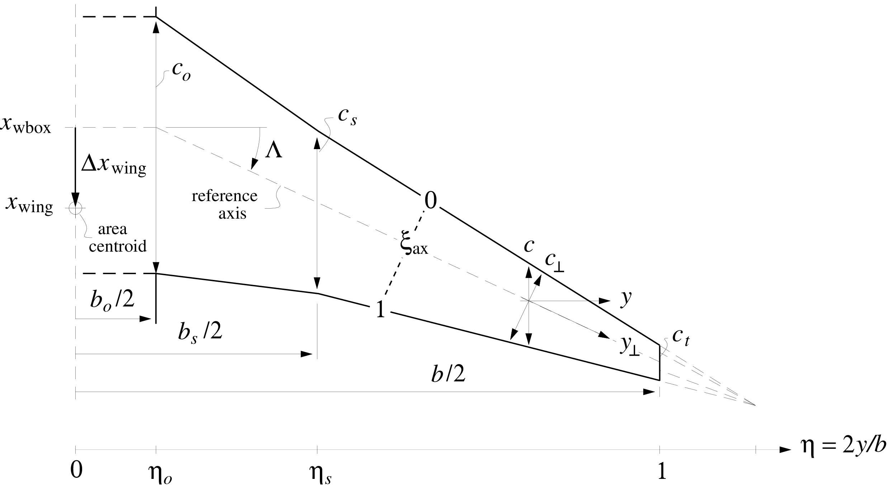

# [Geometry](@id geometry)

## Wing or Tail Planform 

The wing geometry is comprised of a wingbox with fuselage carry-over, an inner section with prescribed taper ratio up to a wing break or "snag", and an outer section with a separately prescribed taper ratio. The geometry is defined relative to a central axis defined by the overall sweep angle, ``\Lambda``.

The surface geometry relations derived below correspond to the wing.
Most of these apply equally to the tails if the wing parameters are
simply replaced with the tail counterparts.




```@eval
using Markdown
Markdown.parse_file(joinpath("../..", "src/aero","theory_geometry.md"))
```

```@docs
aerodynamics.set_wing_geometry!(W,CL,qinf,wing)
```