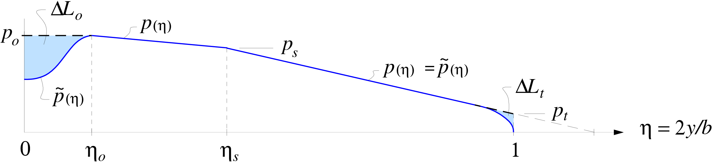

# Lift

Surface lift distributions $\tilde{p}$ are defined in terms of a
baseline piecewise-linear distribution $p{\scriptstyle (\eta)}$ defined
like the chord planform, but with its own taper ratios $\gamma_s$ and
$\gamma_t$. 


Piecewise-linear aerodynamic load ``\tilde{p} {\scriptstyle (\eta)}``,
with modifications at center and tip.

The segments are integrated to compute the lift contribution to the wing root load, ``p_o``, as required by structural computations. The sectional lift distribution is treated as an input to induced drag and surface drag computations.

```@eval
using Markdown
Markdown.parse_file(joinpath("../..", "src/aero","theory_lifting.md"))
```

```@docs
aerodynamics.wing_loading(wing, rclt, rcls, N, W, Lhtail)

aerodynamics.tail_loading!(tail,S, qne)

aerodynamics.wing_section_cls(wing,γt,γs,
            CL,CLhtail,
            duo,dus,dut)


```
