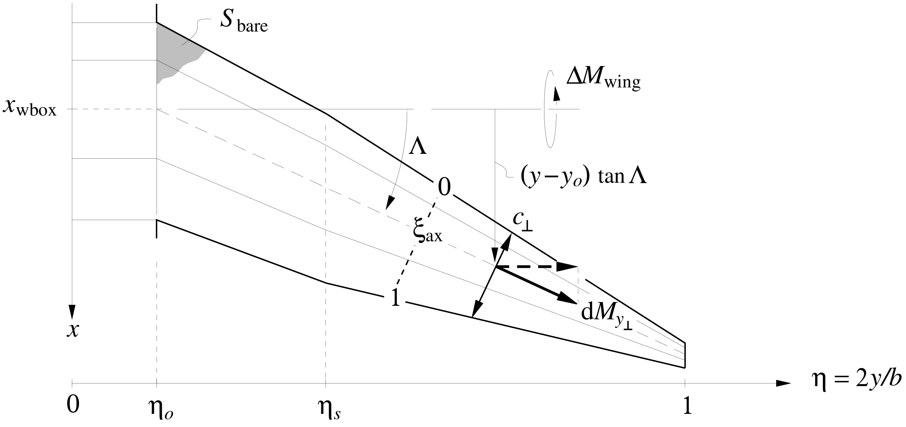

!!! details "📖 Theory - Surface pitching moment"

    The surface's reference axis is at some specified chordwise fractional
    location $\xi_{\rm ax}$, as shown in the first figure. The
    profile pitching moment acts along the span-axis coordinate
    $y_{\scriptscriptstyle \perp}$, and scales with the normal-plane chord
    $c_{\scriptscriptstyle \perp}$. These are shown in
    the first figure, and
    related to the spanwise and streamwise quantities via the sweep angle.

    $$\begin{aligned}
    y_{\scriptscriptstyle \perp}& = & y /  \cos \Lambda 
    %\label{yperp} \\
    c_{\scriptscriptstyle \perp}& = & c \: \cos \Lambda 
    %\label{cperp} \\
    V_{\scriptscriptstyle \perp}& = & V_{\!{\scriptscriptstyle \infty}}\: \cos \Lambda 
    %\label{Vperp} 
    \end{aligned}$$ 

    The airfoil's pitching moment contribution shown in the figure below is

    $$\begin{aligned}
    dM_{y_{\scriptscriptstyle \perp}} & =  
    \frac{1}{2} \rho V_{\scriptscriptstyle \perp}^2 \: c_{\scriptscriptstyle \perp}^2 \: c_m  \:\: {\rm d}y_{\scriptscriptstyle \perp}
    \\ \\
    c_m {\scriptstyle (\eta)}& =  \left\{
    \begin{array}{lcl}
    \; c_{m_o} & , & 0 < \eta < \eta_o
    \\[0.5em]
    \displaystyle
    \; c_{m_o} + (c_{m_s} \!-\! c_{m_o}\,) 
                \frac{\eta \!-\! \eta_o}{\eta_s\!-\!\eta_o}
    & , & \eta_o < \eta < \eta_s
    \\[0.25em]
    \displaystyle
    \; c_{m_s} + (c_{m_t} \!-\! c_{m_s}\,) 
                \frac{\eta \!-\! \eta_s}{1\!-\!\eta_s}
    & , & \eta_s < \eta < 1
    \end{array}
    \right.
    %\label{cmeta}
    \end{aligned}$$ 

    and including the contribution of the lift load
    $\tilde{p}$ with its moment arm gives the following overall wing
    pitching moment $\Delta M_{\rm wing}$ increment about the axis center
    location. 
    $$\begin{aligned}
    {\rm d}\Delta M_{\rm wing}& \!=\! & 
    \tilde{p}
    \left[ c_{\scriptscriptstyle \perp}\! \left(\xi_{\rm ax}\!-\!{\textstyle \frac{1}{4}}\right) \! \cos\Lambda
          \,-\, (y\!-\!y_o) \tan\Lambda \right]  {\rm d}y 
    \:+\: {\rm d}M_{y_{\scriptscriptstyle \perp}} \, \cos\Lambda \hspace{3em}
    \end{aligned}$$ 

    Integrating this along the whole span then gives the
    total surface pitching moment about its root axis. 

    $$\begin{aligned}
    \Delta M_{\rm wing}& \!=\!  
    (p_o \, b_o + 2\Delta L_o) \, c_o \! \left( \xi_{\rm ax} \!-\! {\textstyle \frac{1}{4}}\right) 
    \nonumber \\
    & \!+ \;\! 
    \cos^2 \! \Lambda \;
    b \int_{\eta_o}^1 p{\scriptstyle (\eta)}\: c{\scriptstyle (\eta)}\left( \xi_{\rm ax} \!-\! {\textstyle \frac{1}{4}}\right) 
    \: {\rm d}\eta 
    \nonumber \\
    & \!-\!\; 
    \frac{b}{2} \, \tan\!\Lambda \: b \int_{\eta_o}^1 p{\scriptstyle (\eta)}(\eta\!-\!\eta_o) 
    \; {\rm d}\eta 
    \nonumber \\
    & \!+\!\;  2 \Delta L_t \left[
    c_o \lambda_t \left( \xi_{\rm ax} \!-\! {\textstyle \frac{1}{4}}\right) \cos^2\!\Lambda 
    \;-\;
    \frac{b}{2} (1\!-\!\eta_o) \, \tan\!\Lambda \right]
    \nonumber \\
    & \!+\!\; \frac{1}{2} \rho V_{\!{\scriptscriptstyle \infty}}^2 \, \cos^4 \! \Lambda \; b \!
    \int_{\eta_o}^1 \!\! c_m {\scriptstyle (\eta)}\: {c{\scriptstyle (\eta)}}^2 \:\: {\rm d}\eta 
    \\
    %%
    \Delta M_{\rm wing}& \!=\; 
    p_o \, b \, c_o \: \eta_o \,
    (1 \!+\! f_{L_{\scriptstyle o}}) \! \left( \xi_{\rm ax} \!-\! {\textstyle \frac{1}{4}}\right) 
    \nonumber \\
    & \!+\!\;
    p_o \, b \, c_o \left( \xi_{\rm ax} \!-\! {\textstyle \frac{1}{4}}\right) \cos^2 \! \Lambda \;
    \frac{1}{3}
    \left[ \,
    \left( 1 + {\textstyle \frac{1}{2}}\left(\lambda_s \!+\!\gamma_s\right) + \lambda_s \gamma_s
          \right)(\eta_s \!-\! \eta_o) 
    \right.
    \nonumber \\
    & \hspace{9em}
    \left.
    \,+\,
    \left( \lambda_s \gamma_s + 
          {\textstyle \frac{1}{2}}\left(\lambda_s \gamma_t\!+\!\gamma_s\lambda_t\right)
        + \lambda_t \gamma_t
          \right)(1 \!-\! \eta_s) \, \right]
    \nonumber \\
    & \!-\!\;
    p_o \, b \, c_o \: \frac{\tan\Lambda}{K_o} \, 
    \frac{1}{12} \left[ \,
          \left( 1 \!+\! 2\gamma_s \right) (\eta_s \!-\! \eta_o)^2 
    \,+\,  \left( \gamma_s \!+\! 2\gamma_t\right) (1 \!-\! \eta_s)^2
    \,+\,  3\left( \gamma_s \!+\! \gamma_t \right) (\eta_s \!-\! \eta_o)(1 \!-\! \eta_s)
            \, \right]
    \nonumber \\
    & \!+\!\;
    2 \, p_o \, b \, c_o \, f_{L_{\scriptstyle t}}\, \lambda_t \, \gamma_t \left[
    K_o \lambda_t \left( \xi_{\rm ax} \!-\! {\textstyle \frac{1}{4}}\right) \cos^2\!\Lambda 
    \;-\; {\textstyle \frac{1}{2}}(1\!-\!\eta_o) \, \tan\!\Lambda \right]
    \nonumber \\
    & \!+\!\; 
    \frac{1}{2} \rho V_{\!{\scriptscriptstyle \infty}}^2 \, S \, c_o \, \frac{\cos^4\!\Lambda}{K_c} 
    \frac{1}{12}
    \left[ \left(
          c_{m_o} (3             \!+\! 2           \lambda_s \!+\! \lambda_s^2)
        + c_{m_s} (3 \lambda_s^2 \!+\! 2           \lambda_s \!+\!   1        )
          \right)(\eta_s\!-\!\eta_o)  \right.
    \nonumber \\
    &
    \left.
    +     \left(
          c_{m_s} (3 \lambda_s^2 \!+\! 2 \lambda_s \lambda_t \!+\! \lambda_t^2)
        + c_{m_t} (3 \lambda_t^2 \!+\! 2 \lambda_s \lambda_t \!+\! \lambda_s^2)
          \right)(1\!-\!\eta_s)  
    \right]
    \hspace{3em}
    %\label{DMwing}
    \end{aligned}$$ 

    By using the relation 

    $$\begin{aligned}
    p_o \, b & = & \frac{1}{2} \rho V_{\!{\scriptscriptstyle \infty}}^2 \, S \:
    \frac{1}{K_p} \left( C_{\!L} \!-\! \frac{S_{\rm h}}{S} C_{\!L_{\rm h}} \right)
    \end{aligned}$$ 

    and the equation above it gives the equivalent pitching moment coefficient
    constant and $C_{\!L}$ derivative. 

    $$\begin{aligned}
    \Delta C_{\!M_{\rm wing}} \;\equiv\;
    \frac{\Delta M_{\rm wing}}{{\textstyle \frac{1}{2}}\rho V_{\!{\scriptscriptstyle \infty}}^2 S c_o}
    & \!=\;  \Delta C_{m_0} 
    \,+\, \frac{{\rm d}C_m}{{\rm d}C_{\!L}} 
    \left( C_{\!L} \!-\! \frac{S_{\rm h}}{S} C_{\!L_{\rm h}} \right)
    \\
    \frac{{\rm d}C_m}{{\rm d}C_{\!L}} 
    & \!=\! 
    \frac{1}{K_p} \left\{ \rule[-1.25ex]{0ex}{4.5ex}
    \eta_o \,
    (1 \!+\! f_{L_{\scriptstyle o}}) \! \left( \xi_{\rm ax} \!-\! {\textstyle \frac{1}{4}}\right) 
    \right.
    \nonumber \\
    & 
    + \, \left( \xi_{\rm ax} \!-\! {\textstyle \frac{1}{4}}\right) \cos^2 \! \Lambda \;
    \frac{1}{3}
    \left[ \,
    \left( 1 + {\textstyle \frac{1}{2}}\left(\lambda_s \!+\!\gamma_s\right) + \lambda_s \gamma_s
          \right)(\eta_s \!-\! \eta_o) 
    \right.
    \nonumber \\
    &
    \left.
    \,+\,
    \left( \lambda_s \gamma_s + 
          {\textstyle \frac{1}{2}}\left(\lambda_s \gamma_t\!+\!\gamma_s\lambda_t\right)
        + \lambda_t \gamma_t
          \right)(1 \!-\! \eta_s) \, \right]
    \nonumber \\
    & 
    - \; \frac{\tan\!\Lambda}{K_o} \,
    \frac{1}{12} \left[ \,
          \left( 1 \!+\! 2\gamma_s \right) (\eta_s \!-\! \eta_o)^2 
    \,+\,  \left( \gamma_s \!+\! 2\gamma_t\right) (1 \!-\! \eta_s)^2 
            \right.
    \nonumber \\
    & 
    \left.
    \,+\, 3\left( \gamma_s \!+\! \gamma_t \right) (\eta_s \!-\! \eta_o)(1 \!-\! \eta_s)
          \rule[-0.5ex]{0ex}{3ex}    \, \right]
    \nonumber \\
    & 
    \left.
    + \; 2 \, f_{L_{\scriptstyle t}}\, \lambda_t \, \gamma_t \left[
    K_o \lambda_t \left( \xi_{\rm ax} \!-\! {\textstyle \frac{1}{4}}\right) \cos^2\!\Lambda 
    \;-\; {\textstyle \frac{1}{2}}(1\!-\!\eta_o) \, \tan\Lambda \right]
    \rule[-1.25ex]{0ex}{4.5ex}  \right\}

    \\
    %
    \Delta C_{m_0} 
    & \!=\! 
    \frac{\cos^4 \!\Lambda}{K_c} \,
    \frac{1}{12}
    \left[ \left(
          c_{m_o} (3             \!+\! 2           \lambda_s \!+\! \lambda_s^2)
        + c_{m_s} (3 \lambda_s^2 \!+\! 2           \lambda_s \!+\!   1        )
          \right)(\eta_s\!-\!\eta_o)  \right.
    \nonumber \\
    & \hspace{1em}
    \left.
    +     \left(
          c_{m_s} (3 \lambda_s^2 \!+\! 2 \lambda_s \lambda_t \!+\! \lambda_t^2)
        + c_{m_t} (3 \lambda_t^2 \!+\! 2 \lambda_s \lambda_t \!+\! \lambda_s^2)
          \right)(1\!-\!\eta_s)  
    \right]
    \hspace{3em}
    %\label{CM0wing}
    \hspace{2em}
    \end{aligned}$$
    
    
