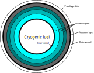
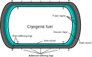

# [Thermal and structural models](@id fueltanks)

Liquid long-chain hydrocarbon fuel is assumed to be stored in the interior of the wings and no additional tanks are needed. The weight of the fuel is accounted for while sizing the wing structure. See [`structures.wing_weights!`](@ref).

However, alternate fuels such as cryogenic liquid hydrogen require additional storage tanks that are insulated pressure vessels. To study novel aircraft designs that may leverage such fuels, the following cryogenic tank models were integrated, along with [heat exchanger](@ref hxers) and [fuel cell](@ref fuelcells) models.

## Theory

!!! details "📖 Theory - Thermal and structural sizing of cryogenic fuel tanks" 
    ### Thermal design
    The fuel tanks in TASOPT are assumed to consist of cylinders with two hemiellipsoidal caps. In general, the cylinders can have a double-bubble shape like the fuselage. To reduce fuel loss during flight as a result of boiling due to heat leakage into the tank (boiloff), the tank requires thermal insulation. Two different insulation architectures are currently supported in TASOPT.jl: an inner vessel covered in foam-based insulation and a double-walled tank with a vacuum layer between the layers. 
    
    The thermal design and analysis method is similar for both insulation architectures. The tank walls are assumed to be made of an isotropic material with high thermal conductivity. The insulation layer, which does not carry structural loads and has a high thermal resistance. The insulation layer itself may consist of additional sublayers of different materials.

    

    As the insulation layer consists of two different geometries across which heat can be transferred (the cylinder and the hemiellipsoids), two slightly different models for thermal resistance must be used. We will first consider heat transfer across a material layer; the vacuum case will be considered later. In the case of heat transfer across a layer between two concentric cylinders, it can be shown from Fourier's law that the thermal resistance, ``R_{cyl}``, is given by 
    ```math
        R_{cyl} = \frac{\ln\left( \frac{R_f}{R_0}\right)} {p_r l_{cyl} k},
    ``` 
    where ``R_0`` is the layer's inner radius, ``R_f = R_0 + t`` is the outer radius (with ``t`` being the layer thickness), ``l_{cyl}`` is the cylinder length, and ``k`` is the thermal conductivity of the layer. The parameter ``p_r`` is the ratio of the cross-section perimeter to the double-bubble radius; for a circular section, ``p_r=2\pi``. In many real materials including insulation foams, the thermal conductivity is a function of temperature. In TASOPT.jl, the mean of the conductivities across the layer is used; it can be shown analytically that this is exact if the conductivity is linear in temperature.
    
    For the hemiellipsoids, an approximate solution can be used, given by 
    ```math
        R_{ell} = \frac{t} {k \left(S_f + S_0 - \frac{S_{he}}{R^2} t^2\right)},
    ``` 
    where ``S_f`` is the surface area of the hemiellipsoid at the final radius, ``S_0`` is the surface area at the initial radius, and ``\frac{S_{he}}{R^2}`` is the ratio of hemiellipsoid surface area to radius squared; for example, this ratio is ``\frac{S_{he}}{R^2}=2\pi`` for a hemisphere. The equation above makes use of the fact that there are two hemiellipsoids at both ends of the tank and represents their total resistance. By combining these resistances, the total resistance of an insulation layer can be found using parallel resistance addition,
    ```math
        R_{l} = \frac{R_{cyl}R_{ell}} {R_{cyl} + R_{ell}}.
    ``` 
    The total resistance across the insulation is the serial addition of the resistances across each layer,
    ```math
        R_{MLI} = \sum_i R_l^i.
    ``` 

    In addition to the insulation resistance, the convective heat transfers from fuel to tank wall and from exterior wall to freestream have to be taken into account. The heat transfer to the freestream can be modeled as having two components: radiation and convection. The heat transfer coefficient from forced convection from the external wall to the freestream can be modeled using the Chilton-Colburn analogy,
    ```math
        h_{air} = \frac{c_f}{2 Pr^{2/3}}  ρ u c_p,
    ``` 
    where ``c_f`` is the skin-friction coefficient, ``Pr`` is the Prandtl number (``Pr\approx 0.71`` for air), ``ρ`` is the freestream air density, ``u`` is the freestream velocity, and ``c_p`` is the specific heat of the freestream air at constant pressure. The skin-friction coefficient can be modeled using a flat-plate solution,[^1]
    ```math
        c_f = \frac{0.02296}{Re_x^{0.139}},
    ```
    where ``\mathrm{Re}_x`` is the Reynolds number at the location fo the fuel tank in the fuselage. To account for the effect of compressibility, the gas properties (density and viscosity) can be calculated at a reference temperature, ``T^\star``, that can be estimated using [^1]
    ```math
        T^\star = T_a\left[0.5\left(1 + \frac{T_w}{T_a}\right)+0.16 r \left(\frac{\gamma-1}{2}\right)M^2\right],
    ```
    where ``M`` is the freestream Mach number, ``T_a`` is the freestream temperature and ``T_w`` is the external wall temperature. The term ``r`` represents a recovery factor and ``r = Pr^{1/3}`` for turbulent air. Due to the high flow velocity, the temperature that the wall reaches in the adiabatic case (``T_{aw}``) is greater than the static air temperature. The adiabatic wall temperature is given by 
    ```math
        T_{aw} = T_a \left(1 + r \frac{\gamma -1}{2} M^2\right),
    ```
    where ``\gamma`` is the ratio of specific heats for air.

    The equivalent resistance due to the freestream is
    ```math
        R_{air} = \frac{1}{ 2\pi h_{air} l_{cyl} R_{fuse}},
    ```
    where ``l_{cyl}`` is the length of the cylindrical portion of the tank and ``R_{fuse}`` is the fuselage radius. 

    Inside the tank, there is a heat transfer from the bulk of the liquid fluid to the tank via natural convection. The Nusselt number for this heat transfer process can be modeled as [^2]
    ```math
        \mathrm{Nu}_l = 0.0605 \mathrm{Ra}_l^{1/3},
    ```
    where ``\mathrm{Ra}_l`` is the tank-length based Rayleigh number and is given by
    ```math
        \mathrm{Ra}_l = \frac{g \beta (T_w-T_f) l^3 Pr}{\nu^2},
    ```
    where ``g`` is the gravitational acceleration, ``\beta`` is the fuel's coefficient of thermal expansion, ``T_w`` is the temperature at the tank wall, ``l`` is the tank length, ``Pr`` is the Prandlt number of the liquid fuel, ``\nu`` is the kinematic viscosity of the fuel, and ``T_f`` is the temperaure of the fuel. The thermal resistance due to natural convection is then
    ```math
        R_{liq} = \frac{l}{\mathrm{Nu}_l k S_{int}},
    ```
    where ``k`` is the thermal conductivity of the liquid fuel and ``S_{int}`` is the internal surface area of the tank. 

    The combined thermal resistance is ``R_{eq} = R_{liq} + R_{MLI} + R_{air}``, such that the total heat transfer rate is ``\dot{Q} = \frac{T_{aw} - T_f}{R_{eq}}``. Once the heat transfer rate is known, the boiloff rate is simply ``\dot{m}_{boil}=\frac{\dot{Q}}{h_v}``, where ``h_v`` is the heat of vaporization of the fuel. A diagram illustrating the different thermal resistances is shown below.

    

    #### Vacuum insulation
    The case when the insulation layer consists of a vacuum has to be modeled separately as a vacuum has zero thermal conductivity. In a vacuum, heat transfer is through a combination of radiation and convection due to residual gas if the vacuum is imperfect. The heat transfer rate due to radiation can be modeled as[^3]
    ```math
        \dot{Q}_{rad} = F_e S_{i} \sigma (T_o^4 - T_i^4),
    ``` 
    where ``S`` is the surface area, ``T`` is the temperature, and the subscript ``i`` refers to the inner surface and ``o`` to the outer surface. The coefficient ``F_e`` is an emissivity factor that acts as an ``average'' of the emissivities of the two surfaces and can be modeled as[^3]
    ```math
        F_e = \frac{1}{\varepsilon_i} + \frac{S_i}{S_o}\left(\frac{1}{\varepsilon_o}-1\right).
    ``` 
    The thermal resistance due to radiation is simply ``R_{rad} = \frac{T_o - T_i}{\dot{Q}_{rad}}``. 

    In addition, the thermal resistance due to the residual gas can be shown to be given by[^3]
    ```math
        R_{conv} = \frac{1}{G p_{res} S_i},
    ```
    where ``p_{res}`` is the pressure of the residual air and ``G`` is a factor that accounts for the thermodynamic properties of the residual gas,
    ```math
        G = F_a \frac{\gamma + 1}{\gamma -1}\sqrt{\frac{R}{8\pi T}},
    ```
    where ``\gamma`` is the gas' ratio of specific heats, ``R`` is the mass-specific gas constant and ``T`` is the temperature of the gauge used to measure the residual pressure (in the code, this is assumed to be the outer-layer temperature). The accommodation coefficient factor, ``F_a`` is given by
    ```math
        F_a = \frac{1}{a_i} + \frac{S_i}{S_o}\left(\frac{1}{a_o}-1\right),
    ```
    where ``a`` denotes the accommodation coefficient, which is a function of temperature and the residual gas composition. Table 7.14 in Barron[^3] provides a set of accommodation coefficients.

    The total thermal resistance of the vacuum layer is ``R_l = \frac{R_{rad} R_{conv}}{R_{rad} + R_{conv}}`` and this can then be used to calculate the equivalent thermal resistance as described above.

    #### Notes on implementation
    The thermal resistance for any insulation layer is, in general, a function of the temperature at the edges of the layer. Because of this, determining the heat transfer and the temperature distribution requires solving a non-linear problem. The current implementation of TASOPT uses the non-linear solver in NLsolve.jl to find the temperature at the edge of each insulation layer. The nonlinear solver in NLsolve is used to find these temperatures and the overall heat transfer rate.

    In the current version of TASOPT, the user can specify whether to use a given thickness and material distribution for the MLI or to size the MLI to achieve a desired boiloff rate. In the latter case, the boiloff rate is an input and the thicknesses of some desired layers of the MLI insulation are changed until the desired boiloff rate is met. The non-linear solver in NLsolve.jl is used to find the change in layer thickness needed to meet this requirement. 

    ### Structural design

    #### Inner vessel
    The cryogenic fuel is contained within an inner vessel, which is sized for a given pressure difference between the high-pressure interior and the exterior. As the boiling temperature of a liquid is a function of temperature, it is preferable to keep the interior pressure constant. The outer radius of the inner vessel is
    ```math
        R_{t,o} = R_{fuse} - d_{fclear} - t_{MLI},
    ```
    where ``d_{fclear} `` is the fuselage clearance distance and ``t_{MLI}`` is the total thickness of the MLI. The skin thickness of the cylindrical portion of the tank wall is sized using [^3]
    ```math
        t_{s,cyl} = \frac{2 \Delta p_{des} R_{t,o}}{2 \sigma_a f_{weld} + 0.8 \Delta p_{des}},
    ```
    where ``\sigma_a`` is the maximum allowable stress for the wall material, ``f_{weld}<1`` is a factor that accounts for structural weakening due to welding, and ``\Delta p_{des}`` is the design tank pressure difference. In the code, the tank is sized for a pressure difference equal to the internal tank pressure, ``\Delta p_{des} = p_{tank}``. The maximum allowable stress is taken to be one fourth of the ultimate tensile strength of the wall material[^3]. The wall thickness of the hemiellipsoidal caps is given by [^3]
    ```math
        t_{s,cap} = \frac{2 \Delta p_{des} R_{t,o} K }{2 \sigma_a f_{weld} + 2 \Delta p_{des} (K- 0.1)},
    ```
    where ``K=\frac{1}{6}(AR^2+2)`` is a factor that accounts for the ellipsoidal aspect ratio (``AR``). Once the wall thicknesses have been determined, the internal tank radius is given by ``R_{t,i}=R_{t,o}-t_{s,cyl} ``. The volume required for the fuel is 
    ```math
        V_{fuel} = \frac{m_{fuel}}{\rho_{mix}},
    ```
    where ``\rho_{mix} = f_{ull}\rho_g + (1-f_{ull})\rho_l`` is the density of the saturated mixture inside the tank, ``\rho_g`` and ``\rho_l`` are the densities of the fuel in saturated gas and liquid phases, and ``f_{ull}>0`` is a factor to account for the fact that the tank must contain some gas volume for ullage. The internal volume of a hemiellipsoidal cap is given by 
    ```math
        V_{cap} =  \frac{A_{cs}}{R^2}\frac{2 R_{t,i}^3}{3AR},
    ```
    where ``\frac{A_{cs}}{R^2}`` is the ratio of the cross-sectional area to the double bubble radius squared; for a circular section, ``\frac{A_{cs}}{R^2}=\pi``.

    Therefore, the internal volume of the cylindrical portion of the tank is ``V_{cyl}=V_{fuel}-2V_{cap}``, and the length of the cylindrical portion can then be found to be
    ```math
        l_{cyl} =  \frac{V_{cyl}}{\frac{A_{cs}}{R^2} R_{t,i}^2}.
    ```
    Once this length is known, the masses of the tank and insulation layers can be found from their respective volumes and densities. To support the tank, stiffener rings that go around the tank circumference are needed. It is assumed that the inner vessel contains two of these stiffeners, which are sized following the process below.

    #### Outer vessel
    If the insulation layer contains a vacuum layer, an additional tank wall is needed to contain the vacuum. Unlike the inner vessel, this outer wall does not fail due to excessive stress, instead, it fails by buckling or collapse[^3]. To prevent buckling, stiffener rings can be used to reduce the effective cylindrical length that can collapse. The unsupported cylinder length is
    ```math
        L =  \frac{l_{cyl}}{N_{stiff} -1},
    ```
    where ``N_{stiff}`` is the total number of stiffener rings and ``l_{cyl}`` is the length of the cylindrical portion of the outer vessel (note that for geometric similarity, this is larger than that of the inner vessel). The collapsing pressure[^3] is taken to be four times the atmospheric pressure, ``p_c = 4p_a``. The thickness for the cylindrical portion of the vessel, ``t`` can then be determined by solving[^3]
    ```math
        p_c = \frac{2.42 E (t/D_o)^{5/2}}{ (1 - \nu^2)^{3/4}  (L/D_o - 0.45\sqrt{t/D_o}) },
    ```
    where ``E`` is the Young's modulus of the wall material, ``\nu`` is its Poisson's ratio, and ``D_o`` is the vessel outer diameter. 

    The wall thickness for the hemiellipsoidal heads can be determined using[^3]
    ```math
        t = K_1 D_o \sqrt{\frac{p_c \sqrt{3 (1 - \nu^2)}}{0.5 E}},
    ```
    where ``K_1`` is a geometric factor that depends on the ellipsoid aspect ratio; some factors can be found in Table 7.6 in Barron[^3].

    Once the wall thicknesses have been determined, the weight of the outer vessel components can be found from their volumes and densities. In addition to the walls, the outer vessel requires stiffener rings to prevent collapse. The vessel is assumed to be supported by two main stiffener rings, ``N_{stiff,m}=2``, that carry the weight and prevent collapse, and a number ``N_{stiff,a}`` of additional rings that only prevent collapse, such that ``N_{stiff}=N_{stiff,m}+N_{stiff,a}``. The general layout in a double-walled tank is shown in the figure below.

    

    #### Stiffening rings
    The stiffening rings act as contact points for the tank supports. In the case of the outer vessel in a double-walled tank, they also prevent collapse of the skin. The main stiffening rings carry the weight of the tank, whereas the outer-vessel additional rings simply serve to prevent skin collapse. In general, the required second moment of area for a ring is given by 
    ```math
        I = I_{load} + I_{collapse},
    ```
    where `` I_{load}`` is the second moment of area needed to withstand the weight loads (only applicable to main rings), and ``I_{collapse}`` is needed to prevent skin collapse (only for outer vessel rings). The second moment of area needed to withstand the loads is
    ```math
        I_{load} = y_{max} \frac{M_{max}}{\sigma_a},
    ```
    where ``y_{max}`` is the maximum distance from the neutral axis in the beam cross-section, ``\sigma_a`` is the maximum allowable beam stress, and ``M_{max}`` is the maximum bending moment in the ring circumference, which can be found using Eqs. (7.4)--(7.5) in Barron[^3] for the inner vessel and Eqs. (7.13)--(7.15) for the outer vessel. The second moment of area to withstand collapse is 
    ```math
        I_{collapse} = \frac{p_c D_o^3 L}{24 E}.
    ```
    In the code, the beams are assumed to be I-beams. The flange thickness (``t_f``) and width (``W``), as well as the web thickness (``t_w``), are taken to be those of a standard 100 x 100 beam. The height of the beam is calculated to match the required second moment of area. For this purpose, the second moment of area of the web is ignored, such that the beam has a second moment of area
    ```math
        I > \frac{W H^2 t_f}{2} + \frac{t_f^3 W}{6},
    ```
    where ``H`` is the distance between the two flange centroids, such that the total beam height is ``H + t_f``. The second moment of area of the web is significant, so ignoring it provides a conservative approximation. This equation is solved for ``H`` by equating the approximate beam second moment of area to the required one.

    The weight of a stiffening ring can then be found as 
    ```math
        W_{stiff} = 2\pi R g [2 W t_f + (H - t_f) t_w ],
    ```
    where ``R`` is the vessel radius and ``g`` is the gravitational acceleration.
    #### Notes on implementation
    In the case of the outer vessel (when there is a vacuum layer), there is a tradeoff between stiffener mass and skin thickness, as adding more stiffeners results in a thinner skin. The optimal number of stiffeners that minizimizes the overall outer vessel mass is found using NLopt.jl with a Nelder-Mead algorithm.  
    
```@docs
CryoTank.tanksize!
CryoTank.res_MLI_thick
CryoTank.size_inner_tank
CryoTank.size_outer_tank
CryoTank.stiffener_weight
CryoTank.optimize_outer_tank
CryoTank.tankWthermal
CryoTank.residuals_Q
```
[^1]: Anderson, John. Fundamentals of Aerodynamics (SI units). McGraw Hill, 2011.
[^2]: Hochstein, J., H-C. Ji, and J. Aydelott. "Effect of subcooling on the on-orbit pressurization rate of cryogenic propellant tankage." 4th Thermophysics and Heat Transfer Conference. 1986.
[^3]: Barron, Randall F. "Cryogenic systems." Monographs on cryogenics (1985).