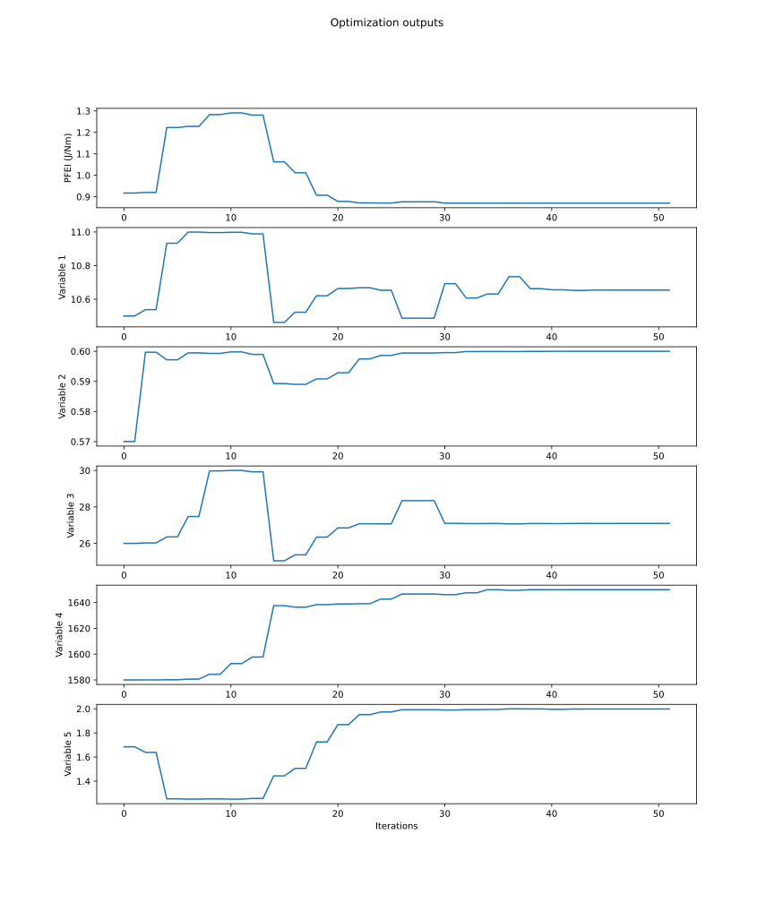

# Example for a Gradient Based Optimization



This example shows how to perform a gradient based optimization on a TASOPT model. It uses the IPOPT optimization module using a central, relative finite difference sensitivity module.

**_NOTE:_**  We are currently working on a autodiff based sensitivity module.

For this example, the design variables are:

1. Aspect Ratio: `AR`
2. Lift Coefficient: `Cl`  
3. Wing Sweep: `Λ`
4. Tt4 at Cruise: `Tt4`
5. Fan Pressure ratio: `pif`

## Initialiation and loading models

Start the script importing the necessary modules.

```julia
# Import modules
using TASOPT
using JuMP
using Ipopt
using PythonPlot
using Test
include(__TASOPTindices__)
```

Initialize arrays used for plotting as well as the finite difference parameter

```julia
design_variables = []
objective_array = []

#Set relative tolerance used in the Finite difference method
epsilon = 1e-5
```

Load the default `aircraft` model and size it to get initial values:

```julia
default_model = load_default_model()
size_aircraft!(default_model)
```

## Setting Optimization Parameters

### Set the input parameters

```julia
input_params = [
    :(ac.parg[igAR]), 
    :(ac.para[iaCL,ipcruise1:ipcruise2,1]),
    :(ac.parg[igsweep]),
    :(ac.pare[ieTt4, ipcruise1:ipcruise2, 1]),
    :(ac.pare[iepif, ipcruise1, 1]) ,
]

# Formatting params for usage 
params = map(p -> TASOPT.format_params(TASOPT.expr_to_string(p)), input_params)
```

### Set the Upper and Lower limits for all design variables as well as initial values

```julia
lower      = [9.0 , 0.53, 25.0, 1400.0, 1.25]
upper      = [11.0, 0.60, 30.0, 1650.0, 2.0 ] 
initial    = [10.5, 0.57, 26.0, 1580.0, 1.685]

```

## Objective Function

```julia
function size_ac(x...)
    # println("State: ",x)
    ac = deepcopy(default_model)
    # Set params
    for (i,x_i) in enumerate(x)
        field_path, index = params[i]
        # Set param value at specific tasopt location for a specific ac model
        TASOPT.setNestedProp!(ac, field_path, x_i, index)
    end
    # Size aircraft
    push!(design_variables, x)
    try
        size_aircraft!(ac,printiter=false)
        push!(objective_array, ac.parm[imPFEI])
        return ac.parm[imPFEI]
    catch
        println("wsize FAILED")
        push!(objective_array, NaN)
        return 1.0e12
    end
end
```

## Gradient Function

```julia
function fdiff_all!(g, x...)
    # Reset model
    ac = deepcopy(default_model)
    # Set current state
    for (i,x_i) in enumerate(x)
        field_path, index = params[i]
        TASOPT.setNestedProp!(ac, field_path, x_i, index)
    end
    # Calculate gradient
    if (size(g)[1] >0)
        gradients = TASOPT.get_sensitivity(input_params; model_state=ac, eps=epsilon, optimizer=true)
        for (k,grads) in enumerate(gradients)
            g[k] = grads
        end
    end
end
```

## Constraint Function
In this optimization we will have a constraint on max fuel weight, max span, min climb gradient, and max Tt3. In order to do this we will specifiy a constraint function as well as a sensitivity function:

```julia
function constraint_fn(ac)
    return (ac.parg[igWfuel]/ac.parg[igWfmax] - 1.0) + (ac.parg[igb]/ac.parg[igbmax] - 1.0) + (1.0 - ac.para[iagamV, ipclimbn,1]/ac.parg[iggtocmin]) + (maximum(ac.pare[ieTt3, :, 1])/900 - 1)
end

function size_constraint(x...)
    # println("State: ",x)
    ac = deepcopy(default_model)
    # Set params
    for (i,x_i) in enumerate(x)
        field_path, index = params[i]
        TASOPT.setNestedProp!(ac, field_path, x_i, index)
    end
    # Size aircraft
    push!(design_variables, x)
    try
        size_aircraft!(ac,printiter=false)
        return constraint_fn(ac)
    catch
        println("wsize FAILED")
        return 1.0e12
    end
end
```

```julia
function fdiff_all_for_constraint!(g, x...)
    # Reset model
    ac = deepcopy(default_model)
    # Set current state
    for (i,x_i) in enumerate(x)
        field_path, index = params[i]
        TASOPT.setNestedProp!(ac, field_path, x_i, index)
    end
    # Calculate gradient
    if (size(g)[1] >0)
        gradients = TASOPT.get_sensitivity(input_params; model_state=ac, eps=epsilon, optimizer=true,f_out_fn=constraint_fn)
        for (k,grads) in enumerate(gradients)
            g[k] = grads
        end
    end
end
```

## Running the optimization

```julia
function exampleOPT()
    model = Model(Ipopt.Optimizer)

    # For almost localy solved (Takes much shorter time, almost solves):
    # set_optimizer_attribute(model, "acceptable_tol", 1e-2)
    # set_optimizer_attribute(model, "acceptable_iter", 1)
    
    @variable(model, lower[i] <= x[i=1:size(initial)[1]] <= upper[i], start=initial[i])

    function eval_f(x...)
        return size_ac(x...)
    end

    function eval_g(x...)
        return size_constraint(x...)
    end

    # Register function so you can use user defined/external functions and specify a custom sensitivity function
    register(model, :eval_f, size(initial)[1], eval_f, fdiff_all!; autodiff = false)
    register(model, :eval_g, size(initial)[1], eval_g, fdiff_all_for_constraint!; autodiff = false)

    @NLobjective(model, Min, eval_f(x...))
    @NLconstraint(model, eval_g(x...) >=0)

    optimize!(model)
    println("""
    termination_status = $(termination_status(model))
    primal_status      = $(primal_status(model))
    objective_value    = $(objective_value(model))
    """)

    return [value(x[i]) for i in 1:size(initial)[1]]
end


opt_time = @elapsed (x) = exampleOPT()

println("Optimization completed in $opt_time with x = $x")

```

## Plotting resulting data

```julia
figure()
savedir = joinpath(__TASOPTroot__,"../example/optimization/")
if !isdir(savedir)
    # If it doesn't exist, create the "optimization" directory
    mkdir(savedir)
    println("The 'optimization' directory has been created.")
end

fig, ax = subplots(size(initial)[1]+1,1, figsize = (12,8), dpi=600)
ax[0].plot(objective_array)
# ax[0].set_xlabel("Iterations")
ax[0].set_ylabel("PFEI (J/Nm)")

for (idx, xi) in enumerate(initial)
    ax[idx].plot([x[idx] for x in design_variables])
    ax[idx].set_ylabel("Variable $idx")
end
ax[size(initial)[1]].set_xlabel("Iterations")
suptitle("Optimization outputs")
figname2 = "Gradient_Optimizer_iterations"
fig.savefig(savedir*figname2*".svg")
```
