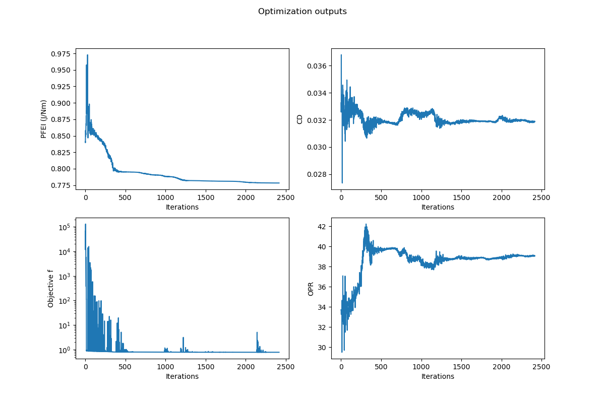

# Example for a Multi-variable Optimization



To run a multi-variable optimization run on an aircraft model first determining your design variables. For this example, the design variables are:

1. Aspect Ratio: `AR`
2. Cruise Altitude: `Alt`
3. Lift Coefficient: `Cl`  
4. Wing Sweep: `Λ`
5. Inner panel taper ratio: `λs`  
6. Outer panel taper ratio: `λt`  
7. Root thickness to chord: `hboxo`
8. Spanbreak thickness to chord: `hboxs`
9. Break/root cl ratio = cls/clo: `rcls`
10. Tip/root cl ratio = clt/clo: `rclt`
11. Tt4: `Tt4`
12. High Pressure Compressor Pressure Ratio: `pihc`
13. Fan Pressure ratio: `pif`

## Initialiation and loading models

Start the script importing `TASOPT.jl`, `PyPlot`, `index.inc`, `NLopt`.

```julia
# Import modules
using PyPlot
using TASOPT
# you can optionally define
# const tas = TASOPT 
# to use as a shorthand
include("../src/misc/index.inc")
# import indices for calling parameters
using NLopt
```

Initialize arrays used for plotting

```julia
xarray = []
farray = []
PFEIarray = []
CDarray = []
OPRarray = []
track_fig = nothing
ft_to_m = 0.3048
```

Load `aircraft` model and size it to get initial values:

```julia
# Load default model
ac = read_aircraft_model(joinpath(TASOPT.__TASOPTroot__, "../example/opt_input.toml"))
#     datafile
# Size aircraft once to get initial values
size_aircraft!(ac)
```

## Setting Optimization Parameters

This example uses a Nedler Mead optimization aimed towards optimizing for passenger fuel emission index (PFEI) while checking for other constraints.

### Set the Upper and Lower limits for all design variables

```julia
# DESIGN VARIABLES
#             AR    Alt(ft)  Cl     Λ     λs  λt   hboxo   hboxs   rcls    rclt     Tt4CR   iepihc iepif
lower      = [7.0 , 20000.0, 0.40, 10.0, 0.1, 0.1, 0.10,   0.10,   0.1,    0.1,     700.0,  6,      0]
upper      = [12.0, 60000.0, 0.65, 40.0, 1.0, 1.0, 0.15,   0.15,   1.4,    1.0,     2000.0, 15,     10] 

```

### Set the initial values for all design variables

```julia
initial =[
        ac.parg[igAR], 33000.0, 0.57, ac.parg[igsweep], 
        ac.parg[iglambdas], ac.parg[iglambdat], ac.parg[ighboxo], 
        ac.parg[ighboxs], ac.para[iarcls, ipcruise1,1], ac.para[iarclt, ipcruise1,1], 1587, 11.46, 1.66
]
```

### Set initial dx values for all design variables

```julia
initial_dx = [ 0.5, 1000.0,  0.05, 0.1,  0.01,0.01,0.01,   0.01,   0.01,   0.01, 100, 0.5,0.2]
```

### Set other optimization factors

```julia
# Set FTOL
f_tol_rel = 1e-5

# Set Optimization module
opt = NLopt.Opt(:LN_NELDERMEAD, length(initial))
# Other Optimization algorithms are also possible:
# # opt = NLopt.Opt(:LN_BOBYQA, length(initial))
# # opt = NLopt.Opt(:LN_COBYLA, length(initial))

# Set Optimization parameters
opt.lower_bounds = lower
opt.upper_bounds = upper
opt.min_objective = obj
opt.initial_step = initial_dx
opt.ftol_rel = f_tol_rel
```

## Objective Function

```julia
function obj(x, grad)
    ac.parg[igAR] = x[1] # Aspect Ratio 
    ac.para[iaalt, ipcruise1, :] .=  x[2] * ft_to_m # Cruise Altitude
    ac.para[iaCL, ipclimb1+1:ipdescentn-1, :] .= x[3] # CL
    ac.parg[igsweep] = x[4] # Wing sweep 
    ac.parg[iglambdas] = x[5] #inner_panel_taper_ratio
    ac.parg[iglambdat] = x[6] #outer_panel_taper_ratio
    ac.parg[ighboxo] = x[7] #root_thickness_to_chord
    ac.parg[ighboxs] = x[8] #spanbreak_thickness_to_chord
    ac.para[iarcls, ipclimb1+1 : ipdescentn-1, :] .= x[9]   #  rcls    break/root cl ratio = cls/clo
    ac.para[iarclt, ipclimb1+1 : ipdescentn-1, :] .= x[10]   #  rclt    tip  /root cl ratio = clt/clo
    ac.pare[ieTt4, ipcruise1:ipcruise2, :] .= x[11] # Tt4
    ac.pare[iepihc, ipclimb1+1 : ipdescentn-1, :] .= x[12] # High Pressure Compressor Pressure Ratio
    ac.pare[iepif, ipclimbn, :] .= x[13] #Fan PR 
    ac.pare[iepilc, :, :] .= 3 # Low Pressure Compressure Pressure Ratio set to 3

    # Sizing aircraft with new ac.parameters
    TASOPT.size_aircraft!(ac, iter =50, printiter=false)
    f = ac.parm[imPFEI]
    push!(PFEIarray, ac.parm[imPFEI])
    push!(xarray, x)
    push!(CDarray, ac.para[iaCD, ipcruise1, 1])
    push!(OPRarray, ac.pare[iept3]/ac.pare[iept2])
    
    # Ensure aircraft weight makes sense
    WTOmax = ac.parg[igWMTO]
    WTO = ac.parm[imWTO,1]
    constraint = WTO/WTOmax - 1.0
    penfac = 10*ac.parg[igWpay]
    f = f + penfac*max(0.0, constraint)^2

    # Ensure fuel volume makes sense
    Wfmax = ac.parg[igWfmax]
    Wf    = ac.parg[igWfuel]
    constraint = Wf/Wfmax - 1.0
    penfac = 10*ac.parg[igWpay]
    f = f + penfac*max(0.0, constraint)^2
    
    println("X̄ = $x  ⇨  PFEI = $(ac.parm[imPFEI]) f = $f, OPR = $(ac.pare[iept3]/ac.pare[iept2]),")
    push!(farray, f)
    
    return f
end
```

## Running the optimization

```julia
opt_time = @elapsed (optf, optx, ret) = NLopt.optimize(opt, initial)
numevals = opt.numevals # the number of function evaluations

println("got $optf at $optx after $numevals iterations which took $(opt_time/60) min (returned $ret)")

```

## Plotting resulting data

### Plot aircraft model details

```julia
figure()
savedir = "./example/optimization/"
if !isdir(savedir)
    # If it doesn't exist, create the "optimization" directory
    mkdir(savedir)
    println("The 'optimization' directory has been created.")
end
figname = "Opt_tutorial_ac_details"
global track_fig = TASOPT.plot_details(ac; ax = track_fig)
plt.savefig(savedir*figname*".png")
```

### Plot optimization outputs over iterations

```julia
fig, ax = plt.subplots(2,2, figsize = (12,8))
ax[1].plot(PFEIarray)
ax[1].set_xlabel("Iterations")
ax[1].set_ylabel("PFEI (J/Nm)")
ax[2].semilogy(farray)
ax[2].set_xlabel("Iterations")
ax[2].set_ylabel("Objective f")
ax[3].plot(CDarray)
ax[3].set_xlabel("Iterations")
ax[3].set_ylabel("CD")
ax[4].plot(OPRarray)
ax[4].set_xlabel("Iterations")
ax[4].set_ylabel("OPR")
plt.suptitle("Optimization outputs")
figname2 = "Opt_tutorial_iterations"
fig.savefig(savedir*figname2*".png")
```
