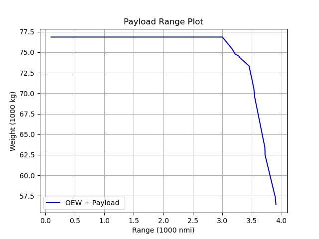

# Payload-range diagram

Once an `aircraft` model is satisfactory, its capabilities and performance can be evaluated over a range of mission conditions. For example:



## Using [`PayloadRange()`](@ref)

To plot the payload-range diagram of an aircraft model with a fleet of missions, a design mission must be chosen, which will determine the second corner point in the diagram. The design mission should be reflected in the `input.toml` via the design range and payload weight (e.g., 3500 nmi and 195 pax):

```toml
[Mission]
    N_missions = 2 # Number of missions to be modeled (first mission is the design mission)
    pax = 195       # Number of passengers in each mission
    range = "3500.0 nmi" # Design Range + second mission range
                            #["3000.0 nmi", "500.0 nmi", "2500.0 nmi", "3550.0 nmi", "3734.0 nmi"] # Design Range + second mission range
    weight_per_pax = "215.0 lbf" # Specify weight per passenger - 
                            # includes luggage [lbm or lbf or kg or N] 
```

After the aircraft is sized, [`PayloadRange()`](@ref) can be called:
```julia
#Use default model for payload-range diagram
using TASOPT
ac = load_default_model() 
size_aircraft!(ac)

TASOPT.PayloadRange(ac)
```

In this approach, only one mission needs to be specified. TASOPT will copy the parameters from the sizing mission (e.g., takeoff altitude and temperature), and vary the payload and range to produce a payload-range diagram. 


## Customizing a payload-range diagram

For a more customizable diagram, a second mission may be specified and the following approach can be followed. First, initialize some variables for mission range and payloads:

```julia
# Make an array of ranges to plot
RangeArray = ac.parm[imRange] * LinRange(0.1,1.2,Rpts)
# Store constant values to compare later
Wmax = ac.parg[igWMTO]
Fuelmax = ac.parg[igWfmax]
Wempty = ac.parg[igWMTO] - ac.parg[igWfuel] - ac.parg[igWpay]
# Arrays for plotting
RangesToPlot = []
PayloadToPlot = []
maxPay = ac.parm[imWpay ]
```

Then, evaluate the mission points with some logic shortcuts:

```julia
for Range = RangeArray
    # Make an array of payloads to plot
    Payloads = (maxPay) * LinRange(1, 0.1, Ppts)
    ac.parm[imRange] = Range
    for mWpay = Payloads
        println("Checking for Range (nmi): ", convertDist(Range, "m", "nmi"), " and Pax = ", mWpay/convertForce(Wpax, "N", "lbf"))
        ac.parm[imWpay ] = mWpay
        # Try fly_mission! after setting new range and payload
        try
            TASOPT.fly_mission!(ac, 2)
            # fly_mission! success: store maxPay, break loop
            mWfuel = ac.parm[imWfuel,2]
            WTO = Wempty + mWpay + mWfuel

            if WTO > Wmax || mWfuel > Fuelmax || WTO < 0.0 || mWfuel < 0.0 
                WTO = 0.0
                mWfuel = 0.0
                println("Max out error!")
                if mWpay == 0
                    println("Payload 0 and no convergence found")
                    maxPay = 0
                end
            else
                maxPay = mWpay
                println("Converged - moving to next range...")
                break
            end     
        catch
            println("Not Converged - moving to lower payload...")      
        end
    end
    append!(RangesToPlot, Range)
    if OEW
        append!(PayloadToPlot, maxPay+Wempty)
    else
        append!(PayloadToPlot, maxPay)
    end
end
```

Plot as desired. `Plots.jl` is a recommended `matplotlib`-like library:

```julia
using Plots

#unit conversions
x = RangesToPlot ./ (1000 * 1852.0) #to nmi
y = PayloadToPlot ./ (9.8 * 1000) #to tonnes

# Create the plot
p = plot(x, y,
    label = "Payload",
    linestyle = :solid, 
    color = :blue,
    xlabel = "Range [1000 nmi]",
    ylabel = "Weight [tonnes]",
    title = "Payload Range Plot",
    grid = true,
    dpi = 300,
    size = (800, 500)
)

# Save the plot to a file
savefig(p, "./PayloadRangeExample.png")

```
