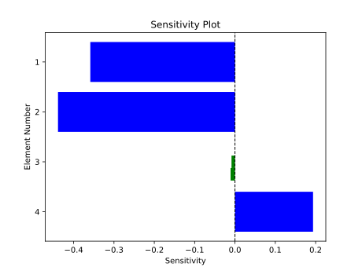

# Calculating Parameter Sensitivities



Using the sensitivity module it is possible to calculate the gradients of TASOPT parameters over PFEI. The sensitivity is calculated using finite difference (central relative difference).

The function input takes parameters as a list of symbols. There are a variety of parameters that can be taken in shown in the example below. The sensitivities can also be plot in a bar chart.

```julia
using TASOPT
include(__TASOPTindices__)
# List of the parameters you want to update as symbols
    params = [
    # Parg type with just one index
    :(ac.parg[igetas]),
    # pare/para type with full range of values across all mission points
    :(ac.pare[ieepolf,:,:]),
    # pare/para type with specific range of mission points [NOTE: This will return a vector of gradients relative to each input param in the range]
    :(ac.pare[iepihc,ipclimbn:ipcruise1,1]),
    # TASOPT strucutral, nested parameter
    :(ac.fuselage.layout.cross_section.radius)
]
epsilon = 1e-5
default_model = load_default_model()
size_aircraft!(default_model)
TASOPT.get_sensitivity(params, model_state = default_model, eps = epsilon)
```

If you want the default model as the model state and epsilon as 1e-5 
you can also call the function directly with just the params:

```julia
sens = TASOPT.get_sensitivity(params)

#Plot Sensitivities
TASOPT.plot_sensitivities(sens)
```
