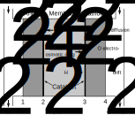

# [PEM fuel cells](@id fuelcells)

To study novel aircraft designs that may leverage cryogenic hydrogen, the following fuel cell models were integrated, along with [cryogenic tank](@ref fueltanks) and [heat exchanger](@ref hxers) models.

## Theory

!!! details "📖 Theory - Proton-exchange membrane fuel cells" 
    Proton-exchange membrane (PEM), also known as polymer electrolyte membrane, fuel cells are electrochemical devices that convert the chemical energy of a fuel to electrical energy through low-temperature oxidation and reduction reactions. Unlike a combustion process in which these processes occur through direct collisions between molecules, the oxidation and reduction reactions are physically separated in fuel cells by a membrane, across which ions produced in the oxidation reaction drift to complete the overall chemical reaction. A diagram of a hydrogen-air fuel cell is shown below. The overall reaction is 
    ```math
    \mathrm{H}_2 + \frac{1}{2}\mathrm{O}_2 \rightarrow \mathrm{H}_2\mathrm{O},
    ```
    and this occurs through two half reactions: an oxidation reaction
    ```math
    \mathrm{H}_2 \rightarrow 2\mathrm{H}^+ + 2e^-,
    ```
    and a reduction reaction
    ```math
    \frac{1}{2}\mathrm{O}_2+2\mathrm{H}^+ + 2e^- \rightarrow \mathrm{H}_2\mathrm{O},
    ```
    where ``e^-`` represents a free electron. In a PEM fuel cell, the oxidation reaction occurs at the anode, with protons drifting across the electrolyte membrane towards the cathode where reduction occurs, while electrons complete an external electric circuit. There are three regions of physical interest in a fuel cell: a bulk flow region, a diffusion layer, and an electrolyte layer. The bulk flow refers to the region outside of the electrodes, which is dominated by advection. The diffusion region is the region inside the porous electrodes, where there cannot be significant advection and molecular motion is governed by diffusion. The electrolyte is the region between the electrodes, where ions drift to close the circuit.

    

    The voltage across a fuel cell is governed by thermodynamics and different loss types[^1]
    ```math
    V = E_r - \eta_\mathrm{ohm} - \eta_C - \eta_A,
    ```
    where ``E_r`` is the thermodynamic reversible voltage, ``\eta_\mathrm{ohm}`` is the ohmic overvoltage due to Joule heating, and ``\eta_A`` and ``\eta_C`` are the anode and cathode overvoltages due to activation and concentration losses. The following model is adapted from that in Springer et al.[^2]; two versions of this have been implemented: a low-temperature PEMFC model that closely follows the original one in Springer et al.[^2], and a high-temperature PEMFC model that is based on it but makes modifications to reflect the different operating temperatures and membrane properties.

    ## Reversible voltage

    The maximum theoretical energy that can be converted to electrical energy is given by the change in Gibbs free+- energy (``\Delta G``) in this process. Every mole of hydrogen produces ``nF`` moles of electrons, where ``F`` is the Faraday constant and ``n=2`` is the number of electrons produced for each unit of hydrogen. Therefore, the voltage produced in this reversible reaction is given by
    ```math
    E_r = \frac{\Delta \hat{g}}{nF},
    ```
    where ``\Delta \hat{g}`` is the molar specific change in Gibbs free energy. In general, ``\Delta \hat{g}`` is a function of temperature as well as of reactant pressure. The reversible voltage of a fuel cell can be calculated using the Nernst equation to account for these effects[^1],
    ```math
    E_r = E_0 + \frac{\Delta \hat{s}}{nF}(T-T_0) - \frac{RT}{nF}\ln\left(\frac{p_0^{3/2}}{p_{\mathrm{H}_2} p_{\mathrm{O}_2}^{1/2}}\right),
    ```
    where ``T`` is the fuel cell temperature, ``p_0=1\,``atm, ``T_0=298.15\,``K, and ``p_{\mathrm{H}_2}`` and ``p_{\mathrm{O}_2}`` denote the partial pressures of oxygen and hydrogen in the reactants. The term ``E_0`` is the reversible voltage at standard conditions, and it is equal to ``E_0=1.229\,``V for liquid water as a product and ``E_0=1.185\,``V for gaseous water. Similarly, the term ``\Delta \hat{s}`` denotes the molar specific entropy change during the reaction, and it is ``\Delta \hat{s}=-44.34\,``J/(mol K) for gaseous water as a product and ``\Delta \hat{s}=-163.23\,``J/(mol K) for liquid water.

    ## Ohmic losses

    As ions drift through the electrolyte material, they produce ohmic heating as a result of the electrical resistance of the electrolyte. The area-specific resistance (ASR) of the electrolyte can be calculated as
    ```math
    \mathrm{ASR} = \int_0^{t_M} \frac{dz}{\sigma(z)},
    ```
    where ``t_M`` is the electrolyte thickness, ``\sigma`` is the conductivity of the electrolyte material to ionic motion, and ``z`` is a coordinate normal to the electrolyte surface from the anode to the cathode. As the ASR increases with electrolyte thickness, thin electrolytes are preferred. The conductivity depends on the choice of material. 
    
    A common electrolyte in low-temperature PEM fuel cells is Nafion, which shows excellent ion conduction properties but needs to be constantly hydrated. The conduction properties of Nafion depend on its water content, ``\lambda``, defined as the ratio of water molecules to ion conduction sites. An empirical expression for the conductivity of Nafion (in (``\Omega`` cm)``^{-1}``) as a function of  ``\lambda`` and temperature is[^2]
    ```math
    \sigma = \exp\left[1268\left(\frac{1}{303}-\frac{1}{T}\right)\right](0.005139\lambda-0.00326).
    ```
    A key challenge in modeling the ohmic losses is to identify how ``\lambda`` changes depending on the operating parameters. It can be shown that the change in ``\lambda`` in the direction normal to the electrolyte surface is governed by[^2] 
    ```math
    \frac{d\lambda}{dz} = \left(n^\mathrm{SAT}_\mathrm{drag}\frac{\lambda}{11}-\alpha^*\right)\frac{jM_m}{2F\rho_\mathrm{dry}D_\lambda},
    ```
    where ``\alpha^*`` is defined as the ratio of water molecule flux to proton flux (in general an unknown), ``n^\mathrm{SAT}_\mathrm{drag}\approx 2.5`` is the number of water molecules dragged by each proton in fully hydrated Nafion,  ``\rho_\mathrm{dry}=1970\,``kg m``^{-3}`` is the density of dry Nafion, ``M_m\approx 1``kg mol``^{-1}`` is the Nafion equivalent weight, ``j`` is the current density that the fuel cell is operating at, and ``D_\lambda`` is the diffusivity of water in the Nafion membrane. The parameter ``D_\lambda`` is a weak function of ``\lambda``[^2]. 
    
    Water content in the electrode/Nafion interface changes as a function of water activity in the electrode, defined as ``a_w=\frac{x_{\mathrm{H_2O}}p}{p_\mathrm{SAT}}``, where ``x_{\mathrm{H_2O}}`` is the water concentration outside the membrane and ``p_\mathrm{SAT}`` is the saturation partial pressure of water at the fuel cell temperature. If ``a_w\leq 1``, expected at the anode side, the relationship can be expressed with a polynomial from a data fit[^2],
    ```math
    \lambda = 0.043 + 17.81 a_w - 39.85 a_w^2 + 36 a_w^3,
    ```
    and for ``a_w>1``, expected at the cathode, the relationship is linear but with a different slope[^2],
    ```math
    \lambda = 14 +1.4 (a_w-1).
    ```
    As the reaction proceeds, oxygen and hydrogen are consumed and this affects the concentration in the bulk flow. This effect can be captured with a stoichiometric ratio of hydrogen at the anode and another one for oxygen at the cathode, ``\lambda_{\mathrm{H}_2}`` an ``\lambda_{\mathrm{O}_2}``; for example, if ``\lambda_{\mathrm{O}_2}=1``, all the oxygen is consumed in the reaction. 

    To use these relationships, it is necessary to calculate the water and reactant concentrations at the membrane/electrode interface. To do so, it is necessary to first determine the water and hydrogen concentration at station 1 and the water and oxygen concentrations at 3, from a mass balance considering depletion effects. Explicit equations for these concentrations as a function of ``\alpha^*`` and the stoichiometry ratios are given in [^2]. Once these are known, the concentrations at 2 and 3 can be determined from the diffusion of the species (see note below).

    The key step in this model is to calculate ``\alpha^*`` by matching the water concentration (or water content) at the cathode/membrane interface produced by two methods. If the water concentration is solved by integrating the diffusion equation from the cathode side, a water content at the interface ``\lambda^\prime_3`` can be calculated from the water activity. Similarly, the water activity at 3 can be calculated by first integrating the diffusion equation from the anode side to find the water concentration at 2, then calculating the water content at 2 from the activity, and then integrating the equation above for ``\frac{d\lambda}{dz}`` across the membrane to find the water content at 3, ``\lambda_3``. The correct ``\alpha^*`` has been found if ``\lambda^\prime_3 -\lambda_3``. A root finding algorithm is used in the code to find the ``\alpha^*`` that fulfills this condition.
    
    Once ``\alpha^*`` has been determined, it can be used to find the water content profile across the membrane by solving the ODE for ``\lambda`` (done numerically in the code). Finally, the conductivity can be calculated from the expression above and this can be used to determine ASR.

    In contrast, polybenzimidazole (PBI) membranes are commonly used in high-temperature PEMFCs. Unlike Nafion, they do not require to be hydrated and they have a negligible water flux across them. A model for how the conductivity of PBI changes with operating conditions is provided in Jio and Li[^3],
    ```math
    \sigma = \frac{(168\mathrm{DL}^3 - 6324 \mathrm{DL}^2 + 65760 \mathrm{DL} + 8460) b }{T} \exp\left(-\frac{-619.6\mathrm{DL} + 21650}{RT}\right),
    ``` 
    where ``\mathrm{DL}`` is the phosphoric acid doping level, defined as the ratio of phosphoric acid molecules to number of PBI repeat unit (typically of the order of 5), and b is given by
    ```math
    b = \begin{cases}
    1+(0.01704T - 4.767)\mathrm{RH}_{avg} & \text{for }  373.15\leq T\leq 413.15\\
    1+(0.1432T - 56.89)\mathrm{RH}_{avg} & \text{for } 413.15 < T\leq 453.15\\
    1+(0.7T - 309.2)\mathrm{RH}_{avg} & \text{for } 453.15 < T\leq 473.15
    \end{cases}
    ```
    where ``\mathrm{RH}_{avg}`` is the average of the relative humidity in stations 2 and 3, and the relative humidity is simply ``\mathrm{RH}=\frac{x_{\mathrm{H_2O}}p}{p_\mathrm{SAT}}``. To use this expression, it is necessary to calculate the water concentration is stations 2 and 3. As in the low-temperature model, this is done by solving the diffusion equations in Springer et al.[^2] analytically, with the key difference that there is no water flux across the membrane.

    The ohmic overvoltage, or ohmic loss, is given by
    ```math
    \eta_\mathrm{ohm} = j \mathrm{ASR}.
    ``` 
    ### Water saturation
    There are many models for the saturation partial pressure of water. A possible model valid under 383.15 K is [^4]
    ```math
    p_\mathrm{SAT} = \frac{\exp\left(34.494 - \frac{4924.99}{t + 237.1}\right)}{(t + 105)^{1.57}} ,
    ```
    where ``t`` is the temperature in degrees Celsius and ``p_\mathrm{SAT}`` is in pascals. A model for temperatures between 383.15 and 483 K is[^3]
    ```math
    p_\mathrm{SAT} = 0.68737  T^3 - 732.39  T^2 +263390  T -31919000 ,
    ```
    where ``T`` is in kelvin.

    ### Diffusivity
    The diffusion of a species in a multi-species gas is complex. The Stefan-Maxwell expression can be used to model the derivative in space of the concentration of species ``i``,
    ```math
    \frac{dx_i}{dz}= RT \sum_j \frac{x_i N_j - x_j N_i}{p D_{ij}},
    ```
    where the sum is made over all the species that ``i`` can collide with, and ``N`` represents the molar flux. Equations for the spatial derivative of concentration can be found in [^2]; for this particular model, there are closed-form solutions.
    
    This equation requires determining the binary diffusivities of all the species involved. A model for binary diffusivity of species ``i`` and ``j`` is
    ```math
    p D_{i,j} = a \left(\frac{T}{\sqrt{T_{ci} T_{cj}}}\right)^b (p_{ci} p_{cj})^{1/3} (T_{ci} T_{cj})^{5/12}\left(\frac{1}{M_i} + \frac{1}{M_j}\right)^{1/2},
    ```
    where the pressures are in atm and the diffusivity is in cm``^2``/s. For gas pairs involving nonpolar gases, ``a=2.745\times10^{-4}`` and ``b=1.823``. For pairs involving water and another nonpolar gas, ``a=3.640\times10^{-4}`` and ``b=2.334``. The parameters ``T_c`` and ``p_c`` can be found in Table 5.1 in [^1].

    When diffusion is occurring inside a porous material, such as a PEM electrode, the material structure affects the diffusion properties. This can be captured via an effective diffusivity, ``D^\mathrm{eff}``, which is given by
    ```math
    D^\mathrm{eff} = D \varepsilon ^\tau,
    ```
    where ``\varepsilon`` is the porosity of the material (a typical value is 0.4), and ``\tau`` is the tortuosity, which can vary between 1.5 and 10.

    ## Cathode overvoltage
    The fuel cell also experiences voltage drop due to activation losses, since a voltage is required to provide activation energy for the half reactions, and due to concentration losses, as the maximum current is limited by the rate of diffusion from the bulk flow to the electrodes. These losses are most significant at the cathode side; in this model, anode voltage drops are ignored. The cathode overvoltage can be calculated using the Tafel equation,
    ```math
    \eta_C = \frac{RT}{n_C \alpha F} \ln \left[\frac{j}{j_0 \frac{p_C}{p_0} x_{\mathrm{O}_2,3eff}}\right],
    ```
    where ``n_C=4`` is the number of electrons exchanged in the reduction reaction and ``\alpha`` represents a symmetry parameter, typically 0.3--0.5. The effective oxygen concentration at 3, ``x_{\mathrm{O}_2,3eff}``, accounts for the fact that part of the water on the cathode side is actually in liquid phase in low-temperature PEMFCs. For these, it is given by
    ```math
    x_{\mathrm{O}_2,3eff} = \frac{x_{\mathrm{O}_2,3}}{1-x_{liq}},
    ```
    where ``x_{liq} = x_{\mathrm{H_2O},3} - p_\mathrm{SAT} / p_C`` is the fraction of water in the cathode that is in liquid phase. In high-temperature PEMFCs, all water is in gaseous phase, so ``x_{\mathrm{O}_2,3eff} =x_{\mathrm{O}_2,3} ``.

    The exchange current density, ``j_0``, is related to the catalyst properties and effective surface area. A model for it is[^5]
     ```math
    j_0 = j_{0,ref}\frac{A_{eff}}{A}\left(\frac{x_{\mathrm{O}_2,3eff}p_C}{p_0}\right)^\gamma \exp\left[-\frac{E_a}{RT}\left(1-\frac{T}{T_0}\right)\right],
    ```
    where ``j_{0,ref}\sim 10^{-9}`` A/m``^2`` is the reference exchange current density for a platinum catalyst at ``T_0`` and ``p_0``, ``\frac{A_{eff}}{A}`` is the ratio of effective surface area of the catalyst to geometric area (can be of the order of 1000), ``\gamma`` is a parameter in the range of 0.5--1.0, and ``E_a=66`` kJ/mol is the activation energy for oxygen reduction on platinum.

## Functions
### Low-temperature PEM model
```@docs
engine.LT_PEMFC_voltage
```
```@docs
engine.water_balance
```
```@docs
engine.Nafion_diffusion
```
```@docs
engine.conductivity_Nafion
```
```@docs
engine.λ_calc
```
```@docs
engine.dλ_dz_membrane
```

### High-temperature PEM model
```@docs
engine.HT_PEMFC_voltage
```
```@docs
engine.conductivity_PBI
```
### Stack and design
```@docs
engine.PEMsize
```
```@docs
engine.PEMoper
```
```@docs
engine.PEMstackweight
```

### Physics and mathematics
```@docs
engine.water_sat_pressure
```
```@docs
engine.binary_diffusion
```
```@docs
engine.porous_diffusion
```
```@docs
engine.cathode_j0
```
```@docs
engine.RK4
```
```@docs
engine.solve_diffusion_ODE
```

[^1]: O'Hayre, Ryan, et al. Fuel cell fundamentals. John Wiley & Sons, 2016.
[^2]: Springer, Thomas E., T. A. Zawodzinski, and Shimshon Gottesfeld. "Polymer electrolyte fuel cell model." Journal of the electrochemical society 138.8 (1991): 2334.
[^3]: Jiao, K., and X. Li. "A Three‐Dimensional Non‐isothermal Model of High Temperature Proton Exchange Membrane Fuel Cells with Phosphoric Acid Doped Polybenzimidazole Membranes." Fuel Cells 10.3 (2010): 351-362.
[^4]: Huang, Jianhua. "A simple accurate formula for calculating saturation vapor pressure of water and ice." Journal of Applied Meteorology and Climatology 57.6 (2018): 1265-1272.
[^5]: Barbir, Frano. PEM fuel cells: theory and practice. Academic press, 2012.