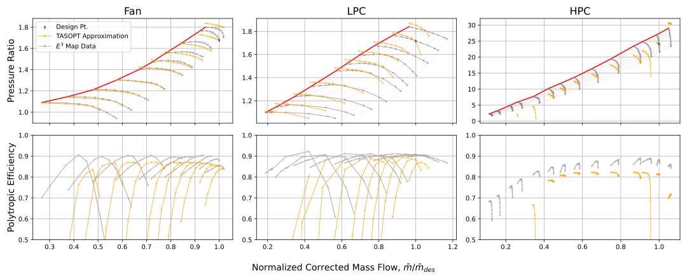

# Propulsion system

A turbofan model is provided in `TASOPT.jl`

## Turbofan model

```@docs
engine.tfcalc!

engine.tfsize!

engine.tfweight

```
## Turbofan Maps

```@docs
engine.Ncmap(pratio, mb, piD, mbD, NbD, Cmap)

engine.ecmap(pratio, mb, piD, mbD, Cmap, effo, piK, effK)

engine.Ncmap1(pratio, m, piD, mbD, NbD, ABCDm, iabcd, Tr, pr)

engine.ecmap1(pratio, m, piD, mbD, ABCDm, iabcd, effo, Tr, pr)

engine.etmap(dh, mb, Nb, piD, mbD, NbD, ept0, Tmap, Tt, cpt, Rt)

engine.Pimap(mb, Nb, piD, mbD, NbD, Cmap)

engine.tfoper!

```

## Turbofan Cooling

```@docs

engine.mcool(ncrowx, Tmrow, Tt3, Tt4, dTstreak, Trrat, efilm, tfilm, StA)

engine.Tmcalc(ncrowx, ncrow, Tt3, Tt4, dTstreak, Trrat, efilm, tfilm, StA, epsrow)


```

## Turbomachinery Components
The compressor off-design performance is determined by logarithmic fits to performance data generated from the Energy Efficient Engine ($E^3$) initiative and used in the Numerical Propulsion System Simulation ([NPSS](https://www.swri.org/markets/electronics-automation/software/aerospace-software/numerical-propulsion-system-simulation-npss)). A summary of the $E^3$ initiative can be found [here](https://arc.aiaa.org/doi/10.2514/3.23024) while a more detailed report on the program is hosted by NASA [here](https://ntrs.nasa.gov/citations/19840021807). The logarithmic fits are the same in form as those used by M. Drela in the original version of TASOPT. The specific form of the corrected speed and polytropic efficiency fits are detailed in [Turbofan Sizing and Analysis with Variable cp(T)](../assets/drela_TASOPT_2p16/engine.pdf). However, the coefficients used in this version differ from his documented values, as we find the values listed below more closely replicate the $E^3$ maps used. Plots of the $E^3$ data and the fits evaluated at the equivalent mass flow and corrected speed for each $E^3$ data point. 

| Compressor | a   | b    | k    | $\widetilde m_0$  | $\Delta a$ | c   | d   | C    | D   |
|------------|-----|------|------|-------------------|------------|-----|-----|------|-----|
| **Fan**    | 3.50| 0.80 | 0.03 | 0.75              | -0.50      | 3.0 | 6.0 | 2.5  | 15.0|
| **LPC**    | 2.50| 1.00 | 0.03 | 0.75              | -0.20      | 3.0 | 5.5 | 4.0  | 6.0 |
| **HPC**    | 1.50| 5.00 | 0.03 | 0.75              | -0.35      | 3.0 | 5.0 | 10.5 | 3.0 |

