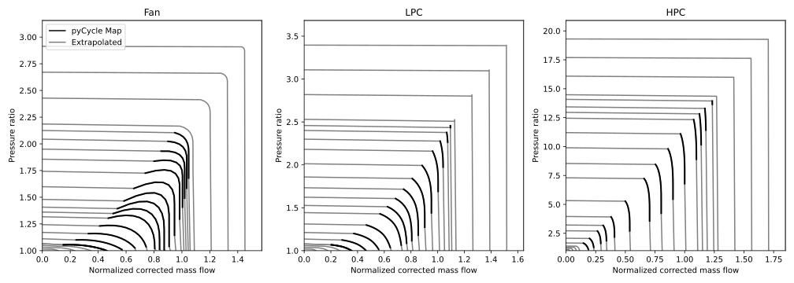

# Propulsion system

A turbofan model is provided in `TASOPT.jl`

## Turbofan model

```@docs
engine.tfcalc!

engine.tfsize!

engine.tfweight

```
## Turbofan Maps

```@docs
engine.Ncmap(pratio, mb, piD, mbD, NbD, Cmap)

engine.ecmap(pratio, mb, piD, mbD, Cmap, effo, piK, effK)

engine.Ncmap1(pratio, m, piD, mbD, NbD, ABCDm, iabcd, Tr, pr)

engine.ecmap1(pratio, m, piD, mbD, ABCDm, iabcd, effo, Tr, pr)

engine.etmap(dh, mb, Nb, piD, mbD, NbD, ept0, Tmap, Tt, cpt, Rt)

engine.Pimap(mb, Nb, piD, mbD, NbD, Cmap)

engine.tfoper!

```

## Turbofan Cooling

```@docs

engine.mcool(ncrowx, Tmrow, Tt3, Tt4, dTstreak, Trrat, efilm, tfilm, StA)

engine.Tmcalc(ncrowx, ncrow, Tt3, Tt4, dTstreak, Trrat, efilm, tfilm, StA, epsrow)


```

## Turbomachinery Components
The compressor off-design performance is determined by interpolation to the compressor maps in pyCycle[^1]. The compressor parameters are scaled to the design pressure ratios, speeds, and mass flow rates in the pyCycle maps by using
```math
    \tilde{p} = \frac{\pi -1}{\pi_D -1}
```
```math
    \tilde{m} = \frac{\bar{m}}{\bar{m}_D}
```
```math
    \tilde{N} = \frac{\bar{N}}{\bar{N}_D},
```
where ``\pi`` represents the pressure ratio, ``\bar{m}`` is the corrected mass flow rate, ``\bar{N}`` is the corrected speed, and the subscript ``D`` denotes the design values. For a given set of compressor parameters, the normalized parameters ``\tilde{p}``, ``\tilde{m}``, and ``\tilde{N}`` are used to calculate the dimensional values in the pyCycle map space. 

The pyCycle maps contain data for pressure ratio, corrected mass flow rate, and isentropic efficiency as a function of corrected speed and R-line parameter. However, the turbofan operation function, [`tfoper!()`](@ref engine.tfoper!), is set up so that the polytropic efficiency and corrected speed is calculated from the pressure ratio and corrected mass flow rate. Therefore, a reverse interpolation problem is required to compute these parameters. For this, the compressor maps are extrapolated and a standard non-linear solver is used in [`find_NR_inverse_with_derivatives()`](@ref engine.find_NR_inverse_with_derivatives) to calculate the corrected speed and R-line parameter that correspond to given corrected mass flow rate and pressure ratio. The extrapolated pressure ratio and polytropic efficiency maps are shown below. These parameters are then translated to the scaled map by using ``\tilde{p}``, ``\tilde{m}``, and ``\tilde{N}`` in [`calculate_compressor_speed_and_efficiency()`](@ref engine.calculate_compressor_speed_and_efficiency), which also returns the polytropic efficiency and derivatives.



```@docs
engine.calculate_compressor_speed_and_efficiency

engine.find_NR_inverse_with_derivatives
```
[^1]: https://github.com/OpenMDAO/pyCycle