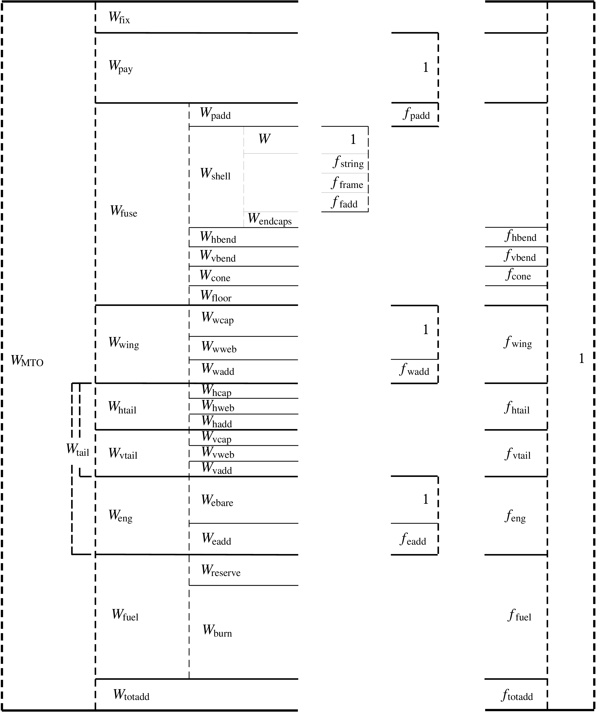

## TASOPT Weight Model

### Overall Weight Breakdown

In calculating the weight models, TASOPT combines:

- **Fundamental, physics-based structural models** for the primary structures (fuselage, wing, tail), sized by specified load factors and material properties.
- **Empirically derived fractional weights** (for items such as seats, furnishings, equipment, etc.) that scale with either payload or primary structure area/weight.

As shown in the figure above, each component in the aircraft can be divided into sub-weights, some of which are explicitly derived from geometry and stress analyses, and others that are assigned via fractional or fixed scaling. Altogether the overall flying weight of the aircraft is:

$$\begin{aligned}
W 
&=\;r_{\rm pay}\,W_{\rm pay}
\;+\;r_{\rm fuel}\,W_{\rm fuel}
\;+\;W_{\rm fuse}
\;+\;W_{\rm wing}
\;+\;W_{\rm strut}
\;+\;W_{\rm htail}
\;+\;W_{\rm vtail}\\
&\quad+\;W_{\rm eng}
\;+\;W_{\rm hpesys}
\;+\;W_{\rm lgnose}
\;+\;W_{\rm lgmain}.
\end{aligned}$$

where $r_{\mathrm{pay}}$ and $r_{\mathrm{fuel}}$ can range from 0 to 1 to represent partial loads.

---

### [Fuselage Weight](@ref fuselage)

!!! details "📖 Theory - Fuselage Weight Calculation"
    The fuselage structural weight is calculated using:

    1. **Pressure shell modeling**
    2. **Bending loads**
    3. **Secondary items** (Seats, galleys, and other interior equipment often scale with **payload**).

These fuselage-related weights (shell, floor beams, tail cone, added bending material, etc.) plus passenger-proportional items are summed to get the total fuselage weight, expressed mathematically as:

$$\begin{aligned}
W_{\rm fuse} &= \,
W_{\rm fix}\:+\: 
W_{\rm apu}\:+\: 
W_{\rm padd}\:+\: 
W_{\rm seat}
\nonumber \\
& + \; 
W_{\rm shell}\:+\: 
W_{\rm cone}\:+\:
W_{\rm window}\:+\: 
W_{\rm insul}\:+\: 
W_{\rm floor}
\nonumber \\
& +\;
W_{\rm hbend}\:+\: 
W_{\rm vbend}
\end{aligned}$$
where

- $W_{\rm fix}$ is a fixed weight (cockpit, instruments, etc.).
- $W_{\rm apu}$,$W_{\rm seat}$, $W_{\rm padd}$ scale with passenger payload or seating capacity.
- $W_{\rm shell}$, $W_{\rm cone}$, $W_{\rm floor}$ come from explicit structural and geometric modeling (pressurization, bending, torsion).
- $W_{\rm hbend}$, $W_{\rm vbend}$ represent added fuselage skin/stringer material for horizontal and vertical bending loads.
---

### [Wing Weight](@ref wingtail)

TASOPT’s wing weight model first computes the **primary wingbox** weight via beam theory, sizing spar caps and webs to meet bending and shear stress limits under specified load factors. Each panel (inner and outer) is integrated for structural volume, as well as for **maximum possible fuel volume**. Secondary elements (leading and trailing-edge devices, ribs, flaps, spoilers, etc.) are included through empirical fraction multipliers on the primary structure.

The total wing structural weight is:

$$\begin{aligned}
W_{\rm wing} &= \,
2 \,\bigl(\,W_{\mathrm{s,\,cen}} + W_{\mathrm{s,\,inn}} + W_{\mathrm{s,\,out}}\bigr)\bigl(1 + f_{\mathrm{w\,add}}\bigr)
\end{aligned}$$

where \(W_{\mathrm{s,\,cen}}\), \(W_{\mathrm{s,\,inn}}\), and \(W_{\mathrm{s,\,out}}\) are the structural weights of the center, inner, and outer wing panels, respectively, and \(f_{\mathrm{w\,add}}\) is the sum of fractional add-ons (flaps, slats, ailerons, etc.).

Fuel weight in the wing is tracked separately. TASOPT can allow partial fuel loads or full loads, integrated into overall CG calculations.

---

### [Tail Weight](@ref wingtail)

Both horizontal and vertical tails are sized much like a small wing:
- Each tail’s planform is analyzed for maximum tail-load conditions (e.g., at never-exceed dynamic pressure).
- Spars and skins are sized with the same beam-type approach.
- The final tail weight sums with the fuselage to include the tail cone, sometimes lumped into a single “rear mass” for bending load computations.

---

### Engine Weight

Engine weight is partly derived from more empirically based correlations. The **bare engine weight** $W_{\mathrm{e,\,bare}}$ scales with turbofan design parameters (mass flow, overall pressure ratio, bypass ratio). Added fractions for accessories, fuel systems, and pylons yield the overall engine system weight:

$$\begin{aligned}
W_{\rm bare} &=\; n_{\rm eng}\,W_{e_1}\!\bigl(\dot{m}_D,\; OPR_D,\;BPR_D\bigr),\\[6pt]
W_{\rm add} &=\; W_{\rm bare}\,f_{\rm eadd},\\[6pt]
W_{\rm pylon} &=\;\bigl(W_{\rm bare} + W_{\rm add} + W_{\rm nace}\bigr)\,f_{\rm pylon},\\[6pt]
W_{\rm eng} &=\; W_{\rm bare} + W_{\rm add} + W_{\rm nace} + W_{\rm pylon}
\end{aligned}$$

Here, $W_{\rm bare}$ is determined by the core flow correlation; $W_{\rm add}$ is an empirical fraction of $W_{\rm bare}$; $W_{\rm nace}$ is the nacelle + thrust reverser weight (based on fan diameter, length, etc.), and $W_{\rm pylon}$ accounts for the engine mounting structure.

---
### Emperical Weight Fractions

The aircraft model takes an input for the below weight fractions which are scaled using different aircraft weights:

1. High-Pressure and Electrical Systems ($W_{\rm hpesys}$): Standard set of high-pressure hydraulics, electrical components, or similar systems carried by the aircraft — **scaled using $W_{\rm MTO}$**
2. Landing Gear Weight fractions ($W_{\rm lgnose}$ and $W_{\rm lgmain}$): **scaled using $W_{\rm MTO}$**
3. APU weight fraction: **scaled using $W_{\rm payload}$**
4. Seat weight fraction: **scaled using $W_{\rm payload}$**
5. Added Payload weight fraction: **scaled using $W_{\rm payload}$**
6. Wing flaps weight fraction: **scaled using $W_{\rm wing}$**
7. Wing slats weight fraction: **scaled using $W_{\rm wing}$**
8. Wing aileron weight fraction: **scaled using $W_{\rm wing}$**
9. Wing leading trailing edgae weight fraction: **scaled using $W_{\rm wing}$**
10. Wing ribs weight fraction: **scaled using $W_{\rm wing}$**
11. Wing spoilers weight fraction: **scaled using $W_{\rm wing}$**
12. Wing attachments weight fraction: **scaled using $W_{\rm wing}$**
13. Htail added weight fraction: **scaled using $W_{\rm tail}$**
14. Vtail added weight fraction: **scaled using $W_{\rm tail}$**
15. Engine access weight fraction: **scaled using $W_{\rm eng, bare}$**
16. Pylon weight fraction: **scaled using $W_{\rm eng}$**
