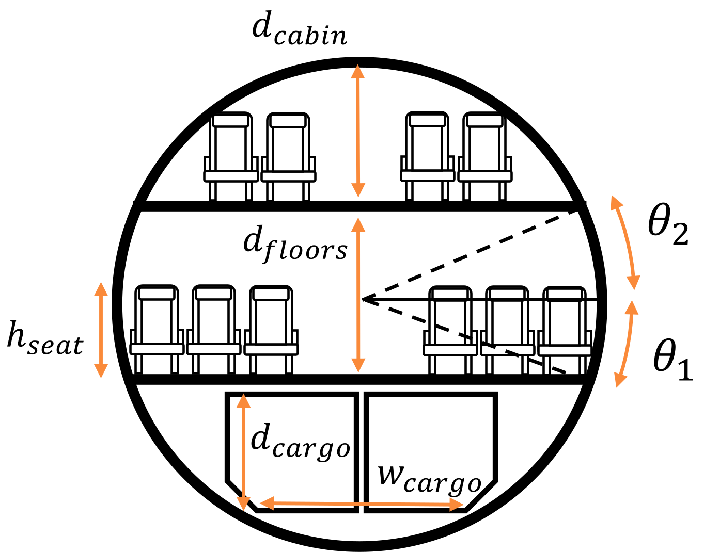

# [Cabin sizing](@id cabin_sizing)
When creating an aircraft input file, the fuselage geometry has to be specified (i.e., the pressure vessel start and end locations, cylindrical portion start and end locations and radius, guesses for the wing and tail). The user is given the option to resize the fuselage if, for example, these parameters are not known or if the radius is to be optimized. This can be accomplished via [`structures.update_fuse_for_pax!()`](@ref).  

## Theory
!!! details "📖 Theory - Cabin sizing"
    The TASOPT input file requires the user to specify a radius and general fuselage layout, including the start and end of the pressure vessel, and the start and end of the cylindrical portions. Whether this provided layout is used or not depends on the flag `calculate_cabin_length` in the `Fuselage.Geometry` input field: this flag is `False` by default, implying that the fuselage length and layout does not get recalculated for the input radius. However, if the flag is set to `True`, the function [`structures.update_fuse_for_pax!()`](@ref) is used to update the fuselage length and layout to accommodate the desired number of passengers.

    To resize the fuselage, information about the number of passengers and seat properties are needed. The number of passengers used the resize the fuselage is set in the input file as `exit_limit` in `Mission`; this is assumed to be the maximum number of people that could fit in the cabin in an all-economy layout. The goal then is to determine the minimum cabin length corresponding to the specified radius and seat properties: seat pitch, width and height. Two key functions are used for this purpose:

    - [`structures.find_floor_angles()`](@ref): This function aims to determine the angular placement of the cabin floor inside the fuselage cross-section. If the cabin has a single deck, this is the angle that maximizes the cabin width. If the aircraft is a double-decker, the main (lower) cabin could be at any angle; the main-cabin angle must then be specified so that the upper-cabin angle can be calculated from the cabin height. The double-decker geometry problem is more involved and is described in the subsequent section.
    
    - [`structures.find_cabin_width()`](@ref) If the fuselage has a single deck, the angular position of the cabin floor is then used by the following function to calculate the maximum width corresponding to that section. For example, if the seat height is 0, the angular placement would be 0 and the maximum width of a single bubble fuselage is ``2R_{fuse}``. When the seat height is greater than 0, the effective cabin width is the distance between the top or bottom of the seats in the cabin, whichever is smallest.

    Once the geometric properties of the floor and cabin width have been determined, the seats are placed in the cabin so as to determine the total cabin length. A 10 ft offset from the front of the cabin is assumed. First, the number of seats abreast is determined by [`structures.findSeatsAbreast()`](@ref). This function assumes an aisle width of 20 inches and a fuselage offset of 6 inches, as seats do not start at the edge of the fuselage. Once the number of seats abreast is known, the number of rows is calculated from the exit-limit number of passengers and the cabin length is calculated from the seat pitch, taking emergency exits into account.

    When the cabin length has been determined, the [`structures.update_fuse_for_pax!()`](@ref) proceeds to update the position of all the structural elements that have to be specified by the user, such as the cylinder and pressure vessel ends, horizontal and vertical tail placements, etc. To do this, the relative distances between these elements specified by the user are maintained. For example, the distance from the end of the fuselage to the horizontal and vertical tails is the same in the resized aircraft as in the user-defined parameters.

!!! details "📖 Theory - Double-decker aircraft"
    When the cabin has two decks, determining the best layout is more involved as the position of the lower floor and the passenger split between the lower and upper cabins is not known in advance. In TASOPT, this is solved as an optimization problem: the optimization variables are the number of passengers in the lower cabin and the lower-cabin floor angle. The geometry of the cabin is shown in the figure below.

    

    The objective function to be minimized is the cabin length, which is the maximum of the lengths of the upper and lower cabins. An optimal design is expected to be one in which both cabins have similar lengths. Constraints are applied on the minimum cargo bay height, ``d_{cargo}``, and on the minimum height of the upper cabin, ``d_{cabin}`` (by default 2 m). The available cargo bay height is calculated so that it can fit the width of a standard unit load device. The objective function is [`structures.find_double_decker_cabin_length()`](@ref), which returns the maximum of the lengths of either cabins (which is used as the objective function), and the number of seats abreast in the main cabin for a later check (ignored in the optimization process). The optimization is done using the `NLopt.jl` optimization suite via [`structures.optimize_double_decker_cabin()`](@ref).
    
    Since there are only two optimization variables, this function uses the `GN_AGS` global optimizer. Once the minimum cabin length has been determined, the fuselage and component layouts get updated in [`structures.update_fuse_for_pax!()`](@ref) as in the single deck case.

!!! details "📖 Theory - Fuselage radius from seats abreast"
    In some circumstances, it may be of interest to calculate the minimum fuselage radius that results in a given number of seats abreast. If multiple fuselage radii are being tested, it is likely that the ones providing best performance are those with the narrowest cabin for a given number of seats abreast (and therefore cabin length).

    In TASOPT, this problem is solved as an optimization problem: the goal is to find the minimum fuselage radius such that the seats abreast in the main cabin are exactly equal to the desired number. This is done with  `structures.find_minimum_radius_for_seats_per_row()`(@ref).

    In this function, two optimizers are used. First, the global optimizer `GN_DIRECT` is used to find the approximate location of the solution with up to 500 function evaluations. This optimizer cannot handle equality constraints directly; instead, the constraint is introduced with a penalty function. The objective function is simply 
    ```math
    f = R_{fuse}+10^3 \Delta s,
    ```
    where ``\Delta s`` is the difference between the desired and actual seats per row for a given radius. The function that computes this difference for a given radius is [`structures.check_seats_per_row_diff()`](@ref).
    ```

    Once the approximate solution has been found, a local optimizer `LN_NELDERMEAD` is used to polish off the solution at a lower computational cost. Finally, the solution is checked to verify it meets the equality constraint.

## Functions

```@docs
TASOPT.structures.update_fuse_for_pax!
TASOPT.structures.find_floor_angles
TASOPT.structures.find_cabin_width
TASOPT.structures.findSeatsAbreast
TASOPT.structures.find_double_decker_cabin_length
TASOPT.structures.optimize_double_decker_cabin
TASOPT.structures.find_minimum_radius_for_seats_per_row
TASOPT.structures.check_seats_per_row_diff
```