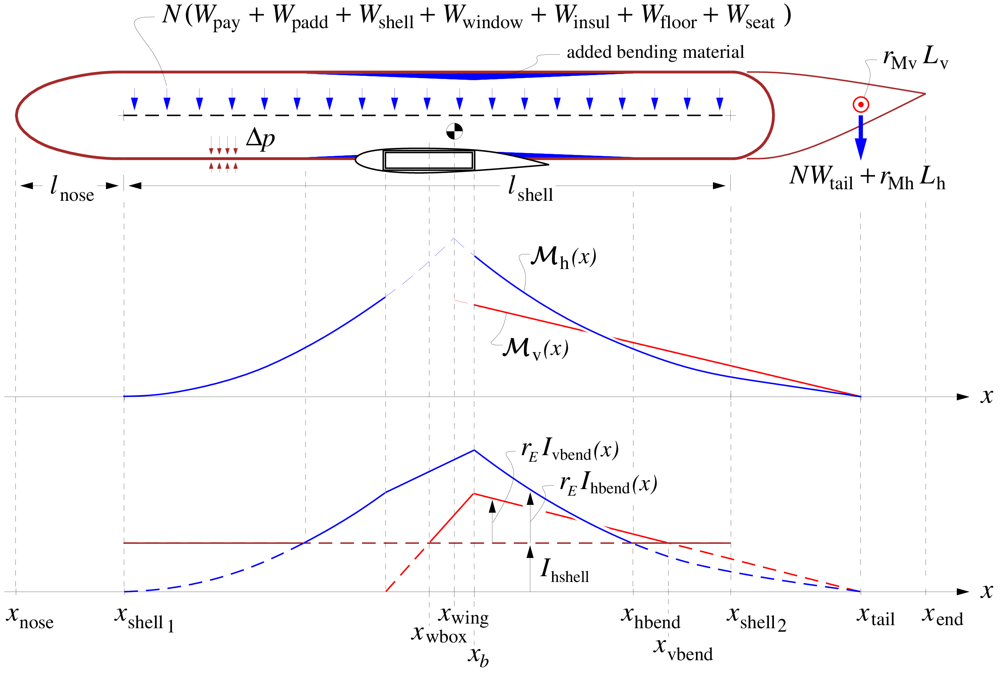
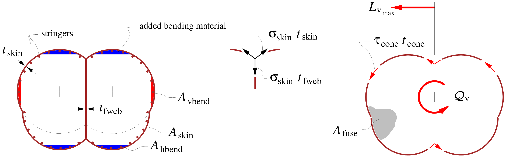
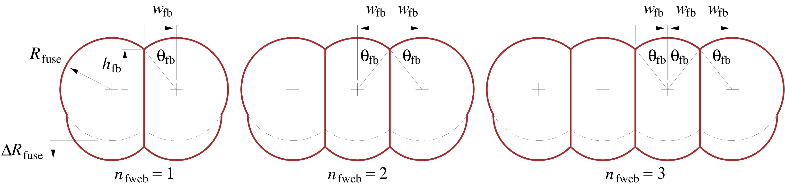

# [Fuselage](@id fuselage)



## Fuselage pressure and torsion loads

The fuselage is modeled as a side-by-side "multi-bubble" pressure vessel
with an ellipsoidal nose endcap and a hemispherical tail endcap, which
is subjected to pressurization, bending, and torsion loads, as shown in
the first two figures. The loaded
cylindrical length of the pressure vessel shell is from
$x_{{\rm shell}_{\,1}}$ to $x_{{\rm shell}_{\,2}}$. 
$$\begin{aligned}
l_{\rm shell}& = & x_{{\rm shell}_{\,2}} \,-\, x_{{\rm shell}_{\,1}}
\end{aligned}$$

The horizontal-axis moment ${\cal M}_{\rm h}{\scriptstyle (x)}$
distributions on the front and back bending fuselage are assumed to
match at location $x_{\rm wing}$, as shown in the first figure. Theoretically
this is the wing's net lift--weight centroid, which varies somewhat
depending the fuel fraction in the wings, the wing's profile pitching
moment and hence the flap setting, and on the aircraft $C_{\!L}$. For
simplicity it will be approximated as the wing's area centroid. Note
that for a swept wing the wing box location $x_{\rm wbox}$ will be
centered somewhat ahead of $x_{\rm wing}$, but it will then also impart
a pitch-axis moment at its location, so that the front and back
${\cal M}_{\rm h}{\scriptstyle (x)}$ distributions must still match at
$x_{\rm wing}$.

The second figure shows the fuselage cross section for the case of a "double-bubble", or two
tubes. The next figure
compares to alternative possible cross sections with three or four
tubes, each specified by the number of webs $n_{\rm fweb}$. The
pressure-vessel skin and endcaps have a uniform thickness
$t_{\rm skin}$, while each of the $n_{\rm fweb}$ tension web(s) has an
average thickness $t_{\rm fweb}$. The cross-sectional area of the skin
is $A_{\rm skin}$, and has stiffening stringers which have a "smeared"
average area
$A_{\rm skin}f_{\rm string}\rho_{\rm skin}/\rho_{\rm bend}$, specified
via the empirical stringer/skin weight fraction $f_{\rm string}$. The
enclosed area $S_{\rm skin}$ enters the torsional stiffness and strength
calculations. The fuselage cross section also shows the possibility of
added bottom bubbles or fairings, extended downward by the distance
$\Delta R_{\rm fuse}$.



The skin and stringers constitute the "shell", which has bending
inertias $I_{\rm hshell}, I_{\rm vshell}$ about the horizontal and
vertical axes. The second figure does not show any hoop-stiffening frames which are
typically required, and whose weight is a specified fraction
$f_{\rm frame}$ of the skin weight. These typically may be offset from
the skin inside of the stringers, and hence are assumed to not
contribute to the skin's circumferential tensile strength.

To address the weight and aerodynamic loads of the tail group on the
fuselage, the horizontal and vertical tails, the tailcone, and any
rear-mounted engines are treated as one lumped mass and aero force at
location $x_{\rm tail}$, shown in Figure 2.

The bending loads on the shell may require the addition of
vertical-bending material concentrated on top and bottom of the fuselage
shell (typically as skin doublers or additional stringers). The total
added cross sectional area is $A_{\rm hbend}{\scriptstyle (x)}$, and the
associated added bending inertia is $I_{\rm hbend}{\scriptstyle (x)}$.
Corresponding added material on the sides has
$A_{\rm vbend}{\scriptstyle (x)}$ and $I_{\rm vbend}{\scriptstyle (x)}$.
Because the wing box itself will contribute to the fuselage bending
strength, these added areas and bending inertias do not match the
${\cal M}{\scriptstyle (x)}$ distribution there, but are made linear
over the wing box extent, as shown in
figure 2.



!!! details "📖 Theory - Cross-section relations"

     The fuselage pressure shell has the following geometric
     relations and beam quantities. 

     $$\begin{aligned}
     \theta_{\rm fb} &= \arcsin (w_{\rm fb}/ R_{\rm fuse})
     \\
     h_{\rm fb} &= \sqrt{R_{\rm fuse}^2 - w_{\rm fb}^2}
     \\
     A_{\rm skin} &=
     \left( 2\pi + 4n_{\rm fweb}\theta_{\rm fb}\right) R_{\rm fuse}\, t_{\rm skin}
     \:+\: 2 \Delta R_{\rm fuse}\, t_{\rm skin}
     \\
     A_{\rm fweb} &=
     n_{\rm fweb}(2 h_{\rm fb}+ \Delta R_{\rm fuse}) \, t_{\rm fweb}
     \\
     A_{\rm fuse} &=
     \left[ \pi + n_{\rm fweb}\left( 2\theta_{\rm fb}+ \sin 2 \theta_{\rm fb}\right) 
          \right] R_{\rm fuse}^2
     \;+\; 2 \left[ R_{\rm fuse}+ n_{\rm fweb}w_{\rm fb}\right] \Delta R_{\rm fuse}
     \end{aligned}$$ 

     The skin has some modulus and density
     $E_{\rm skin}, \rho_{\rm skin}$, while the stringers have some possibly
     different values $E_{\rm bend}, \rho_{\rm bend}$. The effective
     modulus-weighted "shell" thickness $t_{\rm shell}$ can then be defined
     as follows, assuming that only the skin and stringers contribute to
     bending, but not the frames. 

     $$\begin{aligned}
     t_{\rm shell} &= \frac{(E t)_{\rm skin}}{E_{\rm skin}}
     \;=\; t_{\rm skin}
     \left( 1 + r_{\! \scriptscriptstyle E}\, f_{\rm string}\frac{\rho_{\rm skin}}{\rho_{\rm bend}} \right)
     \\
     \rm{where} \hspace{5ex}
     r_{\! \scriptscriptstyle E} &= \frac{E_{\rm bend}}{E_{\rm skin}}
     \end{aligned}$$ 

     This is then convenient for determining the
     modulus-weighted horizontal-axis and vertical-axis bending inertias. The
     fuselage webs, if any, are assumed to be made of the same material as
     the skin. The passenger-access cutouts will not extend all the way to
     the skin/web junctions, so that the webs' contributions are included in
     the overall shell bending inertia. 
     $$\begin{aligned}
     I_{\rm hshell} &=  \frac{(EI)_{\rm hshell}}{E_{\rm skin}} 
     \nonumber \\
          &=  \;\;
     4 \int_0^{\pi/2}  \hspace{-2ex}
     \left( R_{\rm fuse}\sin\theta + \Delta R_{\rm fuse}/2 \right)^2 
     \, R_{\rm fuse}\, t_{\rm shell}\:\: {\rm d}\theta
     \nonumber \\
     &+ 4 n_{\rm fweb}\!\! \int_{\pi/2}^{\pi/2+\theta_{\rm fb}}  \hspace{-2ex}
     \left( R_{\rm fuse}\sin\theta + \Delta R_{\rm fuse}/2 \right)^2 
     \, R_{\rm fuse}\, t_{\rm shell}\:\: {\rm d}\theta
     \;+\; \frac{2}{3} n_{\rm fweb}(h_{\rm fb}+\Delta R_{\rm fuse}/2)^3 t_{\rm fweb}
     \nonumber \\
     &= 
     \left\{ \rule[-0.5em]{0em}{1.5em}
     \left[ \, \pi + n_{\rm fweb}( 2\theta_{\rm fb}\!+\! \sin 2 \theta_{\rm fb}) 
          \right] R_{\rm fuse}^2
     \right.
     \nonumber \\[0.25em]
     &
     \;\; + \; 8 n_{\rm fweb}\cos \theta_{\rm fb}\: (\Delta R_{\rm fuse}/2) \, R_{\rm fuse}
     \nonumber \\[0.25em]
     &
     \left.
     \;\;+ \left[ 2\pi \!+\! 4 n_{\rm fweb}\theta_{\rm fb}\right] (\Delta R_{\rm fuse}/2)^2 \;
     \rule[-0.5em]{0em}{1.5em} \right\} R_{\rm fuse}\, t_{\rm shell}
     \;\;\;+\; \frac{2}{3} n_{\rm fweb}(h_{\rm fb}+\Delta R_{\rm fuse}/2)^3 t_{\rm fweb}
     \\
     I_{\rm vshell}& =  \frac{(EI)_{\rm vshell}}{E_{\rm skin}} 
     \nonumber \\
     & =  \;\;
     4 \int_0^{\pi/2} \hspace{-2ex}
     \left( R_{\rm fuse}\cos\theta + n_{\rm fweb}w_{\rm fb}\right)^2
     \, R_{\rm fuse}\, t_{\rm shell}\:\: {\rm d}\theta
     \nonumber \\
     & +  \;\!
     4 n_{\rm fweb}\!\! \int_{\pi/2}^{\pi/2+\theta_{\rm fb}} \hspace{-2ex}
     \left( R_{\rm fuse}\cos\theta \right)^2
     \, R_{\rm fuse}\, t_{\rm shell}\:\: {\rm d}\theta
     \;+\; \sum_{k=1}^{n_k} 
     4 R_{\rm fuse}t_{\rm shell}\theta_{\rm fb}w_{\rm fb}^2 (2k \!-\! i_k)^2
     \nonumber \\
     &=
     \left[ \rule[-0.5em]{0em}{1.5em}
     \left[ \, \pi + n_{\rm fweb}(2\theta_{\rm fb}\!-\! \sin 2 \theta_{\rm fb}) \right] R_{\rm fuse}^2
     \right.
     \nonumber \\[0.25em]
     & 
     \;\;+ \; 8 \cos \theta_{\rm fb}\: n_{\rm fweb}w_{\rm fb}\, R_{\rm fuse}
     \nonumber \\[0.25em]
     & 
     \;\;+ \left( 2\pi \!+\! 4\theta_{\rm fb}\right) (n_{\rm fweb}w_{\rm fb})^2 \;
     \nonumber \\[0.25em]
     & 
     \left.
     \;+\; 4 \theta_{\rm fb}w_{\rm fb}^2 \sum_{k=1}^{n_k}  (2k \!-\! i_k)^2
     \rule[-0.5em]{0em}{1.5em} \right] R_{\rm fuse}\, t_{\rm shell}
     \\
     n_k  &=  {\rm int}(n_{\rm fweb}/2)
     \\
     i_k  &=  {\rm mod}(n_{\rm fweb}\!+\!1 \, , \, 2) 
     \hspace{4ex}
     \end{aligned}$$ 

     It's useful to note that for the particular case of
     $n_{\rm fweb}=0, w_{\rm fb}=0$, together with $\Delta R_{\rm fuse}= 0$,
     there is only one circle. The areas and bending inertias then reduce to
     those for a single circular cross-section. 

     $$\begin{aligned}
     \hspace{6ex}
     A_{\rm skin}& = & 2 \pi R_{\rm fuse}\, t_{\rm skin}
     \hspace{6ex}  (\rm if\, n_{\rm fweb}=0, w_{\rm fb}= 0, \Delta R_{\rm fuse}= 0)
     \\
     \hspace{6ex}
     S_{\rm skin}& = & \pi R_{\rm fuse}^2
     \hspace{11ex} (\rm if\, n_{\rm fweb}=0, w_{\rm fb}= 0, \Delta R_{\rm fuse}= 0)
     \\
     \hspace{6ex}
     I_{\rm hshell}\;=\; I_{\rm vshell}& = & \pi R_{\rm fuse}^3 \, t_{\rm shell}
     \hspace{7ex}  (\rm{if}\, n_{\rm fweb}=0, w_{\rm fb}= 0, \Delta R_{\rm fuse}= 0)
     \end{aligned}$$ 

     Hence, no generality is lost with this multiple-bubble
     cross-section model.

### Pressure shell loads

The pressurization load from the $\Delta p$ pressure difference produces
the following axial and hoop stresses in the fuselage skin, with the
assumption that the stringers share the axial loads, but the frames do
not share the hoop loads. This assumes a typical aluminum fuselage
structure, where the stringers are contiguous and solidly riveted to the
skin, but the frames are either offset from the skin or have clearance
cutouts for the stringers which interrupt the frames' hoop loads.

$$\begin{aligned}
\sigma_x & = & 
\frac{\Delta p}{2} \, \frac{R_{\rm fuse}}{t_{\rm shell}}
\\
\sigma_\theta & = & 
\Delta p \, \frac{R_{\rm fuse}}{t_{\rm skin}}
\end{aligned}$$ 
An isotropic (metal) fuselage skin thickness
$t_{\rm skin}$ and the web thickness $t_{\rm fweb}$ will therefore be
sized by the larger $\sigma_\theta$ value in order to meet an allowable
stress $\sigma_{\rm skin}$. 
$$\begin{aligned}
t_{\rm skin}& = & \frac{\Delta p \, R_{\rm fuse}}{\sigma_{\rm skin}} 
%%\label{tfuse}
\\
t_{\rm fweb}& = & 2 \, \frac{\Delta p \, w_{\rm fb}}{\sigma_{\rm skin}} 
\end{aligned}$$ 
This particular $t_{\rm fweb}$ value is obtained from
the requirement of equal circumferential stress in the skin and the web,
and tension equilibrium at the 3-point web/skin junction.

The volume of the skin material ${\cal V}_{\rm skin}$ is obtained from
the cross-sectional skin area, plus the contribution of the ellipsoidal
nose endcap and the spherical rear bulkhead. The nose uses Cantrell's
approximation for the surface area of an ellipsoid. 

$$\begin{align}
S_{\rm nose} &\simeq \left[ 2\pi + 4n_{\rm fweb}\theta_{\rm fb}\right] R_{\rm fuse}^2 \left[ \frac{1}{3} + \frac{2}{3} \left( \frac{l_{\rm nose}}{R_{\rm fuse}} \right)^{\!\!8/5} \right]^{\! 5/8} \nonumber \\
& \hspace{5em} \nonumber\\
S_{\rm bulk} &\simeq \left[ 2\pi + 4n_{\rm fweb}\theta_{\rm fb}\right] R_{\rm fuse}^2 \nonumber \\
& \hspace{5em} \nonumber\\
{\cal V}_{\rm cyl} &= A_{\rm skin}\, l_{\rm shell} \nonumber \\
{\cal V}_{\rm nose} &= S_{\rm nose}\, t_{\rm skin} \nonumber \\
{\cal V}_{\rm bulk} &= S_{\rm bulk}\, t_{\rm skin} \nonumber \\
{\cal V}_{\rm fweb} &= A_{\rm fweb}\, l_{\rm shell} \nonumber \\

x \hspace{-0.4ex} {\cal V}_{\rm cyl} &= {\textstyle \frac{1}{2}}(x_{{\rm shell}_{\,1}} + x_{{\rm shell}_{\,2}}) \: {\cal V}_{\rm cyl} \nonumber \\
x \hspace{-0.4ex} {\cal V}_{\rm nose} &= {\textstyle \frac{1}{2}}(x_{\rm nose} + x_{{\rm shell}_{\,1}}) \: {\cal V}_{\rm nose} \nonumber \\
x \hspace{-0.4ex} {\cal V}_{\rm bulk} &= (x_{{\rm shell}_{\,2}} + {\textstyle \frac{1}{2}}\Delta R_{\rm fuse}) \: {\cal V}_{\rm bulk} \nonumber \\
x \hspace{-0.4ex} {\cal V}_{\rm fweb} &= {\textstyle \frac{1}{2}}(x_{{\rm shell}_{\,1}} + x_{{\rm shell}_{\,2}}) \: {\cal V}_{\rm fweb} \nonumber
\end{align}$$

The total fuselage shell weight then follows by
specifying a material density $\rho_{\rm skin}$ for the skin and web.
The assumed skin-proportional added weights of local reinforcements,
stiffeners, and fasteners are represented by the $f_{\rm fadd}$
fraction, and stringers and frames are represented by the
$f_{\rm string},f_{\rm frame}$ fractions. 

$$\begin{aligned}
W_{\rm skin} &= 
\rho_{\rm skin}\, g  \:
      ({\cal V}_{\rm cyl}+ {\cal V}_{\rm nose}+ {\cal V}_{\rm bulk})
\\
W_{\rm fweb} &= 
\rho_{\rm skin}\, g  \: {\cal V}_{\rm fweb}
\\
x \hspace{-0.45ex} W_{\rm skin} &=
\rho_{\rm skin}\, g  \:
      (x \hspace{-0.4ex} {\cal V}_{\rm cyl}+ x \hspace{-0.4ex} {\cal V}_{\rm nose}+ x \hspace{-0.4ex} {\cal V}_{\rm bulk})
\\
x \hspace{-0.45ex} W_{\rm fweb} &=
\rho_{\rm skin}\, g  \: x \hspace{-0.4ex} {\cal V}_{\rm fweb}
\\[0.5em]
W_{\rm shell} &= W_{\rm skin}(1\!+\!f_{\rm string}\!+\!f_{\rm frame}\!+\!f_{\rm fadd}) 
 \:+\: W_{\rm fweb}
\\
x \hspace{-0.45ex} W_{\rm shell} &= x \hspace{-0.45ex} W_{\rm skin}(1\!+\!f_{\rm string}\!+\!f_{\rm frame}\!+\!f_{\rm fadd}) 
 \:+\: x \hspace{-0.45ex} W_{\rm fweb}
\end{aligned}$$

## Fuselage bending loads

In addition to the pressurization and torsion loads, the fuselage also
sees bending loads from its distributed weight load plus the tail weight
and airloads. In the case where the pressurization-sized shell is not
sufficient to withstand this, additional bending material area is
assumed to be added at the top and bottom (total of
$A_{\rm hbend}{\scriptstyle (x)}$), and also sides of the shell (total
of $A_{\rm vbend}{\scriptstyle (x)}$), as shown in figure 2. If the shell
is sufficiently strong, then these areas will be zero.

## Total fuselage weight

The total fuselage weight includes the shell with stiffeners, tailcone,
floor beams, fixed weight, payload-proportional equipment and material,
seats, and the added horizontal and vertical-axis bending material.

$$\begin{aligned}
W_{\rm fuse} &= \,
W_{\rm fix}\:+\: 
W_{\rm apu}\:+\: 
W_{\rm padd}\:+\: 
W_{\rm seat}
\nonumber \\
& + \; 
W_{\rm shell}\:+\: 
W_{\rm cone}\:+\:
W_{\rm window}\:+\: 
W_{\rm insul}\:+\: 
W_{\rm floor}
\nonumber \\
& +\;
W_{\rm hbend}\:+\: 
W_{\rm vbend}
\\ \\
x \hspace{-0.45ex} W_{\rm fuse} &= \!
x \hspace{-0.45ex} W_{\rm fix}+ 
x \hspace{-0.45ex} W_{\rm apu}+ 
x \hspace{-0.45ex} W_{\rm padd}+
x \hspace{-0.45ex} W_{\rm seat}
\nonumber \\
& + \,
x \hspace{-0.45ex} W_{\rm shell}+ 
x \hspace{-0.45ex} W_{\rm cone}+
x \hspace{-0.45ex} W_{\rm window}+ 
x \hspace{-0.45ex} W_{\rm insul}+ 
x \hspace{-0.45ex} W_{\rm floor}
\nonumber \\
& + \,
x \hspace{-0.45ex} W_{\rm hbend}+ 
x \hspace{-0.45ex} W_{\rm vbend}
\end{aligned}$$

```@docs
TASOPT.fusew!
```