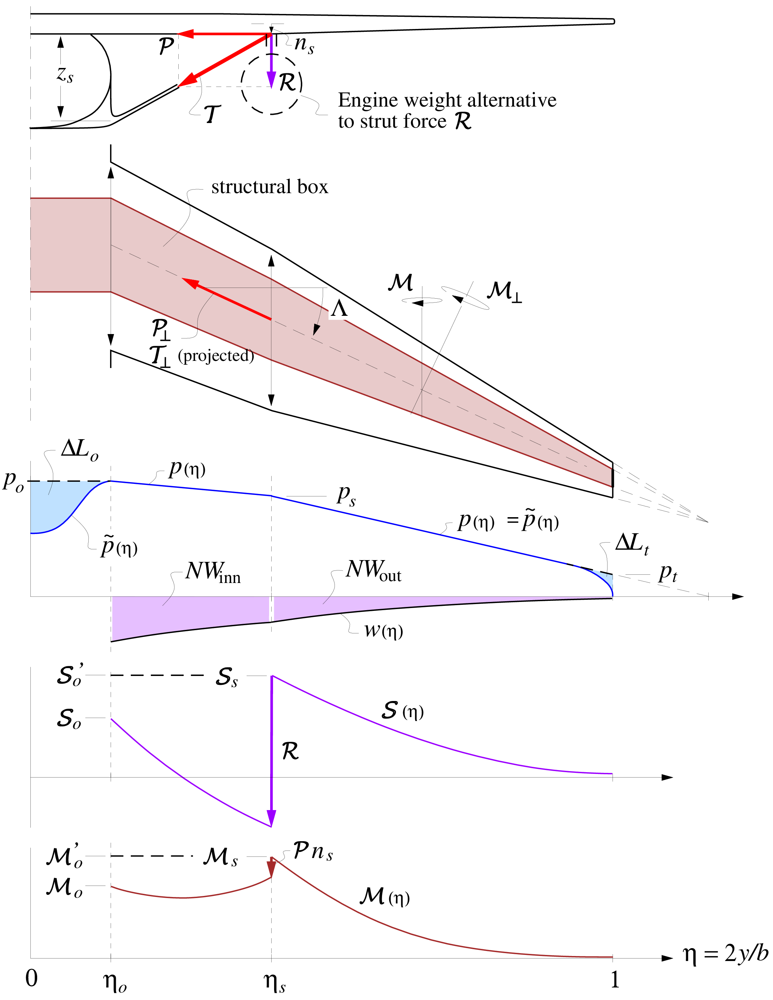
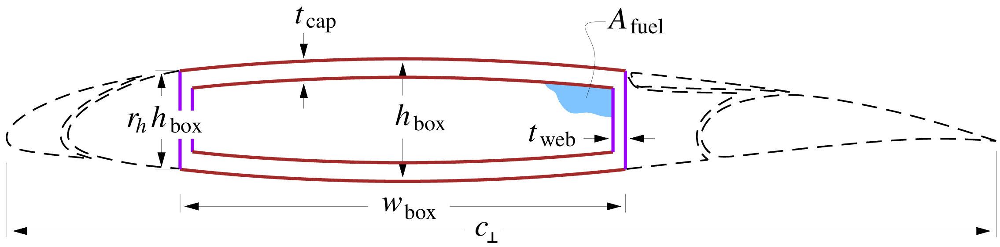

# [Wings and tails](@id wingtail)

The structural loads of the surfaces balance the net loads and moments resulting from weight and aerodynamics (``\tilde{p}``) as summarized in the Figure below. The distributions are also modified by point loads (i.e., engines and an optional strut).



The wing and tail surface stress and weight analyses are performed in the cross-sectional plane, normal to the spanwise axis $y_{\scriptscriptstyle \perp}$ running along the wing box. The assumed wing or tail airfoil and structural box cross-section is shown in the figure below. Note that leading edges, fairings, slats, flaps, and spoilers contribute to weight but not to the primary structure.



```@eval
using Markdown
Markdown.parse_file(joinpath("../..", "src/structures","theory_wingstruct.md"))
```

```@docs

structures.size_wing_section!(section, sweep, sigfac)

structures.wing_weights!(wing, po, gammat, gammas, 
       Nload, We, neout, dyeout, neinn, dyeinn, sigfac, rhofuel; n_wings=2.0)

structures.calculate_centroid_offset(b, bs, bo, λt, λs, sweep)
```
